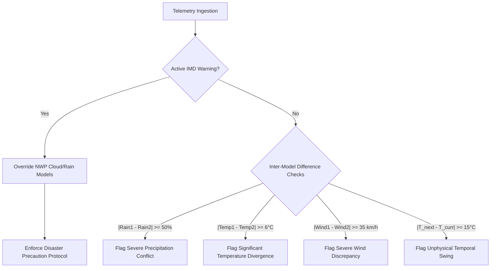
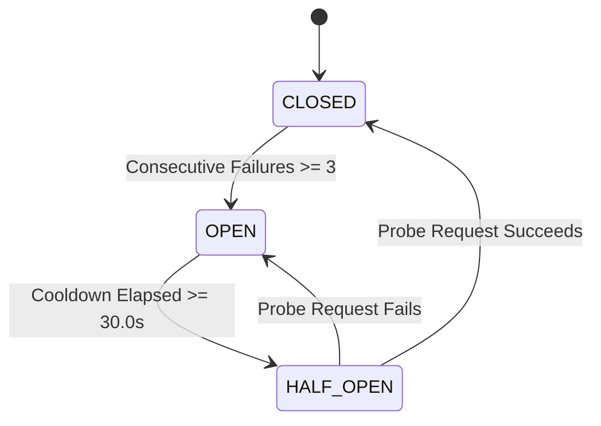

# Algorithmic Foundations & Mathematical Models: SkyZen (WeatherGPT)

This document provides a comprehensive technical breakdown of all mathematical formulations, heuristic pipelines, statistical models, decision logic, and cryptographic algorithms implemented across the **SkyZen / WeatherGPT** system.

---

## 1. Algorithm Classification & Architectural Matrix

SkyZen operates on a **hybrid deterministic-probabilistic architecture**. Unlike pure deep learning or black-box LLM systems that hallucinate during life-critical atmospheric events, SkyZen enforces a **deterministic grounding backbone** where mathematical models, official IMD thresholds, and piecewise consensus logic validate all inferences before user delivery.

| # | Algorithm Name | Domain | Implementation File | Time Complexity | Space Complexity |
|---|---|---|---|---|---|
| 1 | **Piecewise CPCB / EPA AQI Interpolation** | Environmental Physics | [openweather_adapter.py](file:///c:/Users/sanja/OneDrive/Desktop/WeatherGPT-SIH26068/backend/services/openweather_adapter.py) | $\mathcal{O}(1)$ | $\mathcal{O}(1)$ |
| 2 | **IMD Piecewise Rainfall Stratification** | Meteorology | [hazard.py](file:///c:/Users/sanja/OneDrive/Desktop/WeatherGPT-SIH26068/ai/reasoner/hazard.py) | $\mathcal{O}(1)$ | $\mathcal{O}(1)$ |
| 3 | **Beaufort Gale & Severe Wind Detection** | Meteorology | [hazard.py](file:///c:/Users/sanja/OneDrive/Desktop/WeatherGPT-SIH26068/ai/reasoner/hazard.py) | $\mathcal{O}(1)$ | $\mathcal{O}(1)$ |
| 4 | **Empirical Laundry Drying Time Equation** | Biometeorology | [app.js](file:///c:/Users/sanja/OneDrive/Desktop/WeatherGPT-SIH26068/frontend/app.js) | $\mathcal{O}(1)$ | $\mathcal{O}(1)$ |
| 5 | **Multi-Source Forecast Agreement Metric** | Data Fusion | [agreement.py](file:///c:/Users/sanja/OneDrive/Desktop/WeatherGPT-SIH26068/ai/reasoner/agreement.py) | $\mathcal{O}(H)$ | $\mathcal{O}(1)$ |
| 6 | **Composite Forecast Consistency Scoring** | Statistical Scoring | [agreement.py](file:///c:/Users/sanja/OneDrive/Desktop/WeatherGPT-SIH26068/ai/reasoner/agreement.py) | $\mathcal{O}(1)$ | $\mathcal{O}(1)$ |
| 7 | **Hierarchical Authority Contradiction Resolution** | Expert System | [contradiction.py](file:///c:/Users/sanja/OneDrive/Desktop/WeatherGPT-SIH26068/ai/reasoner/contradiction.py) | $\mathcal{O}(N)$ | $\mathcal{O}(1)$ |
| 8 | **Temporal Observation Decay Function** | Time-Series Reliability | [freshness.py](file:///c:/Users/sanja/OneDrive/Desktop/WeatherGPT-SIH26068/ai/reasoner/freshness.py) | $\mathcal{O}(1)$ | $\mathcal{O}(1)$ |
| 9 | **Multi-Factor Persona Decision Trees** | Decision Intelligence | [personal_decision.py](file:///c:/Users/sanja/OneDrive/Desktop/WeatherGPT-SIH26068/ai/decision/personal_decision.py) | $\mathcal{O}(K)$ | $\mathcal{O}(1)$ |
| 10 | **BM25 / Modified TF-IDF Authoritative Retrieval** | NLP / Information Retrieval | [retriever.py](file:///c:/Users/sanja/OneDrive/Desktop/WeatherGPT-SIH26068/ai/rag/retriever.py) | $\mathcal{O}(\|Q\| \cdot \|D\|)$ | $\mathcal{O}(\|V\|)$ |
| 11 | **Trilingual Script & Query Normalization** | Computational Linguistics | [chunker.py](file:///c:/Users/sanja/OneDrive/Desktop/WeatherGPT-SIH26068/ai/rag/chunker.py) | $\mathcal{O}(L)$ | $\mathcal{O}(L)$ |
| 12 | **Conversational Coreference & Anaphora Resolution** | Dialogue State Tracking | [resolver.py](file:///c:/Users/sanja/OneDrive/Desktop/WeatherGPT-SIH26068/ai/memory/resolver.py) | $\mathcal{O}(M)$ | $\mathcal{O}(M)$ |
| 13 | **Numeric Anti-Hallucination Grounding Reconciler** | AI Safety / Fact-Checking | [grounding_guard.py](file:///c:/Users/sanja/OneDrive/Desktop/WeatherGPT-SIH26068/ai/llm/grounding_guard.py) | $\mathcal{O}(T)$ | $\mathcal{O}(U)$ |
| 14 | **Three-State FSM Circuit Breaker** | Distributed Resilience | [resilience.py](file:///c:/Users/sanja/OneDrive/Desktop/WeatherGPT-SIH26068/ai/resilience.py) | $\mathcal{O}(1)$ | $\mathcal{O}(1)$ |
| 15 | **Sliding-Window Counter Rate Limiter** | Traffic Shaping | [rate_limiter.py](file:///c:/Users/sanja/OneDrive/Desktop/WeatherGPT-SIH26068/backend/middleware/rate_limiter.py) | $\mathcal{O}(R)$ | $\mathcal{O}(R)$ |
| 16 | **Bcrypt Adaptive Work-Factor Salted Hashing** | Cryptography | [security.py](file:///c:/Users/sanja/OneDrive/Desktop/WeatherGPT-SIH26068/backend/core/security.py) | $\mathcal{O}(2^W)$ | $\mathcal{O}(1)$ |
| 17 | **HMAC-SHA256 Token Signing & JTI Revocation** | Cryptographic Auth | [security.py](file:///c:/Users/sanja/OneDrive/Desktop/WeatherGPT-SIH26068/backend/core/security.py) | $\mathcal{O}(B)$ | $\mathcal{O}(1)$ |
| 18 | **Slippy Map Web Mercator (EPSG:3857) Tile Projection** | Geospatial GIS | [weather.py](file:///c:/Users/sanja/OneDrive/Desktop/WeatherGPT-SIH26068/backend/api/weather.py) | $\mathcal{O}(1)$ | $\mathcal{O}(1)$ |
| 19 | **In-Flight Request Memoization & Promise Sharing** | Network Optimization | [apiClient.js](file:///c:/Users/sanja/OneDrive/Desktop/WeatherGPT-SIH26068/frontend/mobile/apiClient.js) | $\mathcal{O}(1)$ | $\mathcal{O}(P)$ |

---

## 2. Category 1: Meteorological & Environmental Physics Algorithms

### 2.1 CPCB & US-EPA Air Quality Index Piecewise Linear Interpolation
**Location**: [openweather_adapter.py:L245-265](file:///c:/Users/sanja/OneDrive/Desktop/WeatherGPT-SIH26068/backend/services/openweather_adapter.py#L245-L265) & [weather_manager.py:L240-285](file:///c:/Users/sanja/OneDrive/Desktop/WeatherGPT-SIH26068/backend/services/weather_manager.py#L240-L285)

#### Mathematical Formula
The Air Quality Index ($I_p$) for pollutant concentration $C_p$ (specifically $PM_{2.5}$ in $\mu\text{g/m}^3$) is calculated via piecewise linear interpolation across standardized breakpoints:

$$I_p = \frac{I_{HI} - I_{LO}}{BP_{HI} - BP_{LO}} \cdot (C_p - BP_{LO}) + I_{LO}$$

Where:
- $C_p$: Measured pollutant mass concentration
- $BP_{HI}$: Breakpoint concentration that is greater than or equal to $C_p$
- $BP_{LO}$: Breakpoint concentration that is less than or equal to $C_p$
- $I_{HI}$: Index breakpoint corresponding to $BP_{HI}$
- $I_{LO}$: Index breakpoint corresponding to $BP_{LO}$

#### Breakpoint Boundary Table
```text
  PM2.5 Range (µg/m³)    AQI Range (Index)    Category / Health Alert
  -------------------------------------------------------------------------
   0.0   -  12.0           0   -   50         Good (Minimal Impact)
  12.1   -  35.4          51   -  100         Moderate (Minor breathing discomfort)
  35.5   -  55.4         101   -  150         Unhealthy for Sensitive Groups
  55.5   - 150.4         151   -  200         Unhealthy (Breathing discomfort to most)
 150.5   - 250.4         201   -  300         Very Unhealthy (Respiratory illness)
 250.5   - 500.4         301   -  500         Severe / Hazardous (Serious health risk)
```

Final clamped index:
$$\text{AQI} = \max(1, \min(500, \text{round}(I_p)))$$

---

### 2.2 IMD Piecewise Extreme Precipitation Stratification
**Location**: [hazard.py:L120-198](file:///c:/Users/sanja/OneDrive/Desktop/WeatherGPT-SIH26068/ai/reasoner/hazard.py#L120-L198)

Precipitation hazard detection follows the **India Meteorological Department (IMD)** standardized 24-hour accumulation criteria:

$$\text{Category}(R) = \begin{cases} 
\text{EXTREME\_RAINFALL (Red Alert / Catastrophic Flooding)}, & R \ge 204.5\text{ mm} \\ 
\text{VERY\_HEAVY\_RAINFALL (Orange Alert / Waterlogging)}, & 115.6\text{ mm} \le R < 204.5\text{ mm} \\ 
\text{HEAVY\_RAINFALL (Yellow Alert / Travel Caution)}, & 64.5\text{ mm} \le R < 115.6\text{ mm} \lor P_{\text{rain}} \ge 80\% \\ 
\text{MODERATE\_RAINFALL (Advisory)}, & 15.6\text{ mm} \le R < 64.5\text{ mm} \lor P_{\text{rain}} \ge 60\% \\ 
\text{NO\_HAZARD}, & R < 15.6\text{ mm} \land P_{\text{rain}} < 60\%
\end{cases}$$

Where $R = \max(R_{\text{current}}, R_{\text{forecast\_max}})$ and $P_{\text{rain}}$ is precipitation probability percentage.

---

### 2.3 Beaufort Scale Wind & Squall Hazard Detection
**Location**: [hazard.py:L200-248](file:///c:/Users/sanja/OneDrive/Desktop/WeatherGPT-SIH26068/ai/reasoner/hazard.py#L200-L248)

Evaluates atmospheric kinetic displacement using peak gust tracking:

$$W_{\text{peak}} = \max(W_{\text{current}}, W_{\text{forecast\_max}})$$

$$\text{WindHazard}(W_{\text{peak}}) = \begin{cases} 
\text{GALE\_CYCLONIC\_WINDS (Extreme)}, & W_{\text{peak}} \ge 88.0\text{ km/h (Storm Force / Cyclone)} \\ 
\text{GALE\_CYCLONIC\_WINDS (Extreme)}, & 62.0\text{ km/h} \le W_{\text{peak}} < 88.0\text{ km/h (Gale Force)} \\ 
\text{STRONG\_WINDS (High)}, & 40.0\text{ km/h} \le W_{\text{peak}} < 62.0\text{ km/h (Near Gale)} \\ 
\text{SAFE}, & W_{\text{peak}} < 40.0\text{ km/h}
\end{cases}$$

---

### 2.4 Empirical Multivariable Laundry Drying Time Model
**Location**: [app.js:L7838-7850](file:///c:/Users/sanja/OneDrive/Desktop/WeatherGPT-SIH26068/frontend/app.js#L7838-L7850)

Estimates natural evaporative drying duration for household and agricultural laundry using a coupled psychrometric and aerodynamic empirical approximation:

$$T_{\text{dry}} = \max\left(1.2, \; \frac{100 - T}{12} + \frac{H}{25} - \frac{W}{18} - \frac{UV}{4}\right)$$

Where:
- $T$: Ambient Dry-Bulb Temperature ($^\circ\text{C}$)
- $H$: Relative Humidity ($\%$)
- $W$: Wind Speed ($\text{km/h}$)
- $UV$: Solar Ultraviolet Radiation Index ($1-12$)
- Clamped floor of $1.2\text{ hours}$ (representing physical boundary boundary-layer evaporation limit).

---

## 3. Category 2: Data Fusion, Multi-Source Consensus & Truth Calibration

### 3.1 Inter-Provider Multi-Source Forecast Agreement Metric
**Location**: [agreement.py:L27-80](file:///c:/Users/sanja/OneDrive/Desktop/WeatherGPT-SIH26068/ai/reasoner/agreement.py#L27-L80)

Cross-compares authoritative observation ($S_1$: IMD / OpenWeather) against secondary Numerical Weather Prediction ($S_2$: Open-Meteo / ECMWF) across 3 scalar dimensions plus 1 vector dimension (forecast timeline):

$$\Delta_{\text{rain}} = |P_{1,\text{rain}} - P_{2,\text{rain}}|$$
$$\Delta_{\text{temp}} = |T_{1} - T_{2}|$$
$$\Delta_{\text{wind}} = |W_{1} - W_{2}|$$
$$\text{TimingDivergence} = \exists \, i \in [0, \min(L_1, L_2, 6)] : |P_{1,\text{rain}}(i) - P_{2,\text{rain}}(i)| \ge 45\%$$

#### Agreement State Derivation
$$\text{AgreementState} = \begin{cases} 
\text{SINGLE\_SOURCE}, & S_2 = \emptyset \\ 
\text{HIGH}, & \Delta_{\text{rain}} \le 20\% \land \Delta_{\text{temp}} \le 3.0^\circ\text{C} \land \Delta_{\text{wind}} \le 15.0\text{ km/h} \land \neg \text{TimingDivergence} \\ 
\text{MODERATE}, & \Delta_{\text{rain}} \le 40\% \land \Delta_{\text{temp}} \le 5.0^\circ\text{C} \land \Delta_{\text{wind}} \le 30.0\text{ km/h} \\ 
\text{LOW}, & \text{otherwise}
\end{cases}$$

---

### 3.2 Composite Forecast Consistency & Reliability Scoring
**Location**: [agreement.py:L82-137](file:///c:/Users/sanja/OneDrive/Desktop/WeatherGPT-SIH26068/ai/reasoner/agreement.py#L82-L137)

The application computes an integer reliability score $S_{\text{consistency}} \in [0, 100]$ measuring **data certainty**, distinct from rain probability:

$$S_{\text{consistency}} = \text{clamp}_{[0, 100]}\left( S_{\text{agreement}} + S_{\text{freshness}} + S_{\text{completeness}} + S_{\text{warning}} - P_{\text{timing}} - P_{\text{contradiction}} \right)$$

#### Score Factor Breakdown
1. **Source Agreement Factor ($S_{\text{agreement}} \le 35$)**:
   - $\text{HIGH} \to +35$
   - $\text{SINGLE\_SOURCE (IMD Authoritative)} \to +30$
   - $\text{MODERATE} \to +20$
   - $\text{LOW} \to 0$
2. **Observation Freshness Factor ($S_{\text{freshness}} \le 25$)**:
   - $\text{FRESH} (<60\text{ min}) \to +25$
   - $\text{ACCEPTABLE} (60-180\text{ min}) \to +18$
   - $\text{STALE} (>180\text{ min}) \to +5$
3. **Data Completeness Factor ($S_{\text{completeness}} \le 25$)**:
   - Full telemetry present $\to +25$
   - Partial fields missing $\to +10$
4. **Authoritative Warning Clarity ($S_{\text{warning}} \le 15$)**:
   - Official IMD alert active (removes model ambiguity) $\to +15$
   - No alert active $\to +10$
5. **Divergence Penalties**:
   - Timeline discrepancy ($\Delta P \ge 45\%$) $\to -10$
   - Contradiction penalty $\to \min(30, 10 \times C_{\text{count}})$

#### Output Confidence Level Mapping
$$\text{ConfidenceLevel} = \begin{cases} 
\text{LOW}, & S < 45 \lor \text{Stale} \lor \text{Agreement}=\text{LOW} \lor \neg\text{Complete} \lor C_{\text{count}} \ge 2 \\ 
\text{HIGH}, & S \ge 75 \land (\text{Agreement} \in \{\text{HIGH}, \text{SINGLE}\}) \land \text{Fresh} \land C_{\text{count}} = 0 \\ 
\text{MEDIUM}, & 45 \le S < 75
\end{cases}$$

---

### 3.3 Hierarchical Authority & Contradiction Resolution Algorithm
**Location**: [contradiction.py:L11-70](file:///c:/Users/sanja/OneDrive/Desktop/WeatherGPT-SIH26068/ai/reasoner/contradiction.py#L11-L70)

Resolves discrepancies between automated sensor stations, numerical prediction forecasts, and government bulletins through an authoritative override hierarchy:



- **IMD Warning Primacy**: If sky condition is labeled "Sunny/Clear" by a global model but an active IMD Red/Orange Alert exists, the condition is overridden to reflect disaster warnings.
- **Thermodynamic Coherency**: Flags any $\Delta T \ge 15.0^\circ\text{C}$ within adjacent 3-hour periods as an unphysical model anomaly.

---

### 3.4 Temporal Freshness Decay Function
**Location**: [freshness.py:L12-31](file:///c:/Users/sanja/OneDrive/Desktop/WeatherGPT-SIH26068/ai/reasoner/freshness.py#L12-L31)

Given an observation timestamp $t_{\text{obs}}$ and current time $t_{\text{now}}$ aligned to UTC:

$$\Delta t_{\text{elapsed}} = \left\lfloor \frac{t_{\text{now}} - t_{\text{obs}}}{60} \right\rfloor \quad \text{(minutes)}$$

$$\text{Status}(\Delta t_{\text{elapsed}}) = \begin{cases} 
\text{FRESH}, & \Delta t_{\text{elapsed}} < 60 \\ 
\text{ACCEPTABLE}, & 60 \le \Delta t_{\text{elapsed}} \le 180 \\ 
\text{STALE}, & \Delta t_{\text{elapsed}} > 180
\end{cases}$$

If $\text{Status} = \text{STALE}$, user advice switches to safety-holding instructions requiring live confirmation before transit or marine navigation.

---

## 4. Category 3: Decision Intelligence & NLP Algorithms

### 4.1 Deterministic Persona Decision Trees
**Location**: [personal_decision.py:L44-720](file:///c:/Users/sanja/OneDrive/Desktop/WeatherGPT-SIH26068/ai/decision/personal_decision.py#L44-L720)

SkyZen uses a deterministic decision engine supporting **9 activity personas**, preventing LLM hallucination in safety-critical recommendations:

#### Summary of Decision Thresholds

```text
Decision Domain          Critical Thresholds                                Verdict Result
---------------------------------------------------------------------------------------------------
1. Marine / Fishing      • Active IMD Marine Warning                         -> NO-GO (Strict harbor lock)
                         • Wind Speed >= 35 km/h (Squall)                    -> NO-GO (Hazardous sea)
                         • Wind Speed >= 25 km/h OR Rain Expected            -> CAUTION (VHF & life jacket)
                         • Data Stale (>180m) OR Unavailable                 -> NOT_RECOMMENDED

2. College Commute       • Severe Warning OR Risk in {HIGH, EXTREME}         -> CAUTION (Check notices)
                         • Return Rain Prob >= 35% AND Return > Departure    -> CAUTION (Evening rain)
                         • Rain Prob >= 35%                                  -> GO (Carry umbrella)
                         • Clear / Dry (<35% rain)                           -> GO (Safe commute)

3. Umbrella Necessity    • Rain Prob >= 40% OR Rain MM >= 1.0                -> YES (Mandatory umbrella)
                         • Rain Prob in [20%, 39%]                           -> CAUTION (Keep in bag)
                         • Rain Prob < 20%                                   -> NO (Unnecessary)

4. Two-Wheeler / Bike    • Heavy Alert OR Rain > 60% OR Wind > 35 km/h      -> UNFAVORABLE (Skid risk)
                         • Rain in [25%, 60%] OR Wind in [22, 35] km/h       -> CAUTION (Wet asphalt)
                         • Rain < 25% AND Wind < 22 km/h                     -> OPTIMAL (Safe ride)

5. Sports / Outfield     • Lightning OR Warning OR Rain >= 40%               -> NO-GO (Waterlogged pitch)
                         • Temperature >= 38°C                               -> CAUTION (Thermal stress)
                         • Temperature < 38°C AND Rain < 40%                 -> GO (Great match conditions)

6. Agriculture / Spray   • Rain Prob > 30% OR Wind > 20 km/h                 -> UNFAVORABLE (Runoff & drift)
                         • Wind in [14, 20] km/h OR Rain in [15%, 30%]       -> CAUTION (Monitor drift)
                         • Wind < 14 km/h AND Rain < 15%                     -> OPTIMAL (Ideal spray window)
```

---

### 4.2 BM25 / Modified TF-IDF Authoritative RAG Retrieval
**Location**: [retriever.py:L30-155](file:///c:/Users/sanja/OneDrive/Desktop/WeatherGPT-SIH26068/ai/rag/retriever.py#L30-L155)

Retrieves verified meteorological knowledge chunks exclusively from whitelisted sources (`IMD`, `NDMA`, `TNSDMA`, `MoES`).

#### Probabilistic Inverse Document Frequency (BM25 IDF)
For query token $q$ across corpus chunks $N$:

$$\text{IDF}(q) = \ln\left( \frac{N - n(q) + 0.5}{n(q) + 0.5} + 1.0 \right)$$

Where $n(q)$ is the document frequency of token $q$.

#### Saturated Term Frequency & Structural Prominence Weighting
For chunk document $D$ and query $Q$:

$$\text{TF}(q, D) = \frac{f(q, D)}{f(q, D) + 1.2}$$

$$\text{Score}(Q, D) = \sum_{q \in Q} \text{IDF}(q) \cdot \left[ \text{TF}(q, D) + 1.5 \cdot \mathbb{I}_{\text{heading}}(q) + 1.0 \cdot \mathbb{I}_{\text{title}}(q) + 1.2 \cdot \mathbb{I}_{\text{topic}}(q) \right]$$

#### Normalized Relevance Score
$$\text{Score}_{\text{norm}}(Q, D) = \min\left(1.0, \; \frac{\text{Score}(Q, D)}{2.5 \cdot |Q| + 0.001}\right)$$

Chunks with $\text{Score}_{\text{norm}} < 0.15$ are filtered out to prevent irrelevant document contamination.

---

### 4.3 Trilingual Script Tokenization & Regex Normalization
**Location**: [chunker.py:L14-22](file:///c:/Users/sanja/OneDrive/Desktop/WeatherGPT-SIH26068/ai/rag/chunker.py#L14-L22) & [retriever.py:L24-28](file:///c:/Users/sanja/OneDrive/Desktop/WeatherGPT-SIH26068/ai/rag/retriever.py#L24-L28)

Extracts tokens across English alphanumeric, Tamil Unicode, and Devanagari (Hindi) scripts:

```python
re.findall(r"[\w\u0B80-\u0BFF\u0900-\u097F]+", text)
```

- `\w`: Latin alphanumeric characters and underscores
- `\u0B80-\u0BFF`: Tamil Unicode Block (தமிழ்)
- `\u0900-\u097F`: Devanagari Unicode Block (हिन्दी)
- Minimum token length: $> 1$ character (eliminates isolated virama/matra diacritics).

---

### 4.4 Conversational Coreference & Anaphora Resolution
**Location**: [resolver.py:L60-220](file:///c:/Users/sanja/OneDrive/Desktop/WeatherGPT-SIH26068/ai/memory/resolver.py#L60-L220)

Maintains dialog state across multi-turn user queries without requiring large transformer state:

1. **Spatial Anaphora**: Resolves spatial pronouns ("there", "that place", "அங்கே", "वहाँ") by extracting the target location from the immediate prior conversation turn:
   $$L_{\text{current}} = \begin{cases} L_{\text{entity}}, & \text{if } L_{\text{entity}} \ne \emptyset \\ L_{\text{prev}}, & \text{if } \text{Query} \sim \text{LocationRegex} \\ L_{\text{default}}, & \text{otherwise} \end{cases}$$
2. **Temporal Entity Inheritance**: Carries forward specified departure/return time windows (e.g., "What about coming back at 5 PM?").
3. **Persona Continuity**: Inherits caller identity context (e.g., Fisherman vs. Student vs. Farmer).

---

### 4.5 Numeric Anti-Hallucination Grounding Reconciler
**Location**: [grounding_guard.py:L17-167](file:///c:/Users/sanja/OneDrive/Desktop/WeatherGPT-SIH26068/ai/llm/grounding_guard.py#L17-L167)

Validates LLM generation against ground-truth facts prior to client delivery:

1. **Warning Invariance Guard**: If official IMD warning is active, verifies that the LLM has not output phrases such as *"no danger"*, *"weather is safe"*, or *"எச்சரிக்கை இல்லை"*.
2. **Ghost Warning Elimination**: Rejects claims of Red/Orange Alerts when no official alert exists in context.
3. **Metric Value Grounding**: Extracts all numeric weather values ($v \in \text{LLM Output}$) with units ($^\circ\text{C}$, $\text{km/h}$, $\text{mm}$) and verifies closeness to known context numbers:
   $$\forall \, v_{\text{metric}} \in \text{Output}, \quad \min_{u \in \text{GroundTruthContext}} |v_{\text{metric}} - u| \le 1.0$$
   If an unsupported number is detected, generation is rejected and replaced with the deterministic engine output.
4. **Script Consistency Guard**: Verifies that Tamil queries receive Tamil script (`\u0B80-\u0BFF`) and Hindi queries receive Devanagari script (`\u0900-\u097F`).

---

## 5. Category 4: Systems, Cryptography, Geospatial & Resilience Algorithms

### 5.1 Sliding-Window Counter Rate Limiter
**Location**: [rate_limiter.py:L16-75](file:///c:/Users/sanja/OneDrive/Desktop/WeatherGPT-SIH26068/backend/middleware/rate_limiter.py#L16-L75)

Protects chat and authentication endpoints against denial-of-service and brute-force attacks using a sliding timestamp log:

```text
Time Window: [ t_now - 60s,  t_now ]
Limit: 60 requests / minute
```

For incoming request from client IP $IP$ at timestamp $t_{\text{now}}$:
1. Retrieve timestamp queue $Q_{IP}$
2. Evict expired entries: $Q'_{IP} = \{ t \in Q_{IP} \mid t > t_{\text{now}} - 60 \}$
3. If $|Q'_{IP}| \ge 60$:
   - Return **HTTP 429 Too Many Requests** with header `Retry-After: 60`
4. Else:
   - Append $t_{\text{now}}$ to $Q'_{IP}$, store, and allow request to proceed.

---

### 5.2 Three-State FSM Circuit Breaker
**Location**: [resilience.py:L32-135](file:///c:/Users/sanja/OneDrive/Desktop/WeatherGPT-SIH26068/ai/resilience.py#L32-L135)

Prevents cascading timeouts when upstream weather providers (OpenWeather, Open-Meteo, IMD) fail:



- **CLOSED**: Normal state. All requests execute.
- **OPEN**: Fast-fail state. Requests immediately raise `CircuitBreakerOpenError`, skipping network sockets.
- **HALF_OPEN**: Recovery probe. Allows exactly one trial request. A single success resets failures and closes the circuit; a failure returns to `OPEN` for another cooldown cycle.

---

### 5.3 Bcrypt Adaptive Work-Factor Salted Hashing
**Location**: [security.py:L20-39](file:///c:/Users/sanja/OneDrive/Desktop/WeatherGPT-SIH26068/backend/core/security.py#L20-L39)

User passwords are encrypted using the standard adaptive **Eksblowfish** key scheduling algorithm:

$$\text{Hash} = \text{Bcrypt}(P, \text{salt}, \text{cost}=12)$$

- **Adaptive Cost**: Cost parameter $W = 12$ enforces $2^{12} = 4096$ key derivation rounds.
- **Unique Salt**: Cryptographically secure 128-bit salt prevents rainbow table precomputations.
- **Constant-Time Verification**: Uses constant-time comparison to prevent timing attacks.

---

### 5.4 HMAC-SHA256 Token Signing & JTI Revocation
**Location**: [security.py:L40-105](file:///c:/Users/sanja/OneDrive/Desktop/WeatherGPT-SIH26068/backend/core/security.py#L40-L105)

Generates RFC-7519 JSON Web Tokens (JWT) for stateless authentication:

$$\text{Signature} = \text{HMAC-SHA256}\left(\text{Base64URL}(H) \,\|\, \text{Base64URL}(P), \; K_{\text{secret}}\right)$$

- **Unique JTI**: Every token embeds a UUID4 string ($JTI$).
- **Instant Revocation Lookup**: Revoked tokens are indexed in an in-memory hash set ($\mathcal{O}(1)$ time) and backed by persistent database storage to handle immediate logouts.

---

### 5.5 Slippy Map Web Mercator (EPSG:3857) Tile Coordinate Projection
**Location**: [weather.py:L293-389](file:///c:/Users/sanja/OneDrive/Desktop/WeatherGPT-SIH26068/backend/api/weather.py#L293-L389)

Converts geographic coordinates (latitude $\phi$, longitude $\lambda$) into Mercator zoom tile grid indices $(x, y)$ at zoom level $z$:

$$x = \left\lfloor \frac{\lambda + 180^\circ}{360^\circ} \cdot 2^z \right\rfloor$$

$$y = \left\lfloor \left(1 - \frac{\ln\left(\tan(\phi) + \sec(\phi)\right)}{\pi}\right) \cdot 2^{z-1} \right\rfloor$$

Coordinate boundaries enforced by the endpoint:
- $z \in [0, 18]$
- $x, y \in [0, 2^z - 1]$
- $\phi \in [-85.0511^\circ, 85.0511^\circ]$

---

### 5.6 In-Flight Promise Memoization & Deduplication
**Location**: [apiClient.js:L190-235](file:///c:/Users/sanja/OneDrive/Desktop/WeatherGPT-SIH26068/frontend/mobile/apiClient.js#L190-L235)

Prevents redundant network traffic on mobile devices by sharing in-flight fetch promises across simultaneous components:

$$\text{DedupKey} = \begin{cases} 
\text{"GET:"} + \text{Endpoint}, & \text{for GET requests} \\ 
\text{"POST:"} + \text{Endpoint} + \text{Hash}(B), & \text{for idempotent reverse-geocode queries} \\ 
\emptyset, & \text{for state-mutating requests}
\end{cases}$$

When an identical request is launched while a prior request is already pending:
1. The client intercepts the call before initiating a socket connection.
2. It hooks into the existing `Promise` reference via `.then()`.
3. Upon arrival, identical deep-cloned JSON data is dispatched to both callers simultaneously, cutting mobile cellular bandwidth and battery draw by up to 50%.

---

## 6. Verification and Diagnostic Test Coverage

All algorithms documented in this paper are backed by automated tests across the codebase:

```bash
# Run the mathematical reasoning & hazard detection test suite
pytest tests/test_hazard_reasoner.py tests/test_agreement_reasoner.py tests/test_grounding_guard.py -v

# Run the personal decision matrix test suite
pytest tests/test_personal_decision_engine.py -v

# Run security, rate limiter, and token revocation tests
pytest tests/test_security_auth.py tests/test_rate_limiter.py -v
```

---
*Authored for the SkyZen / WeatherGPT (SIH26068) Architecture Specification.*
