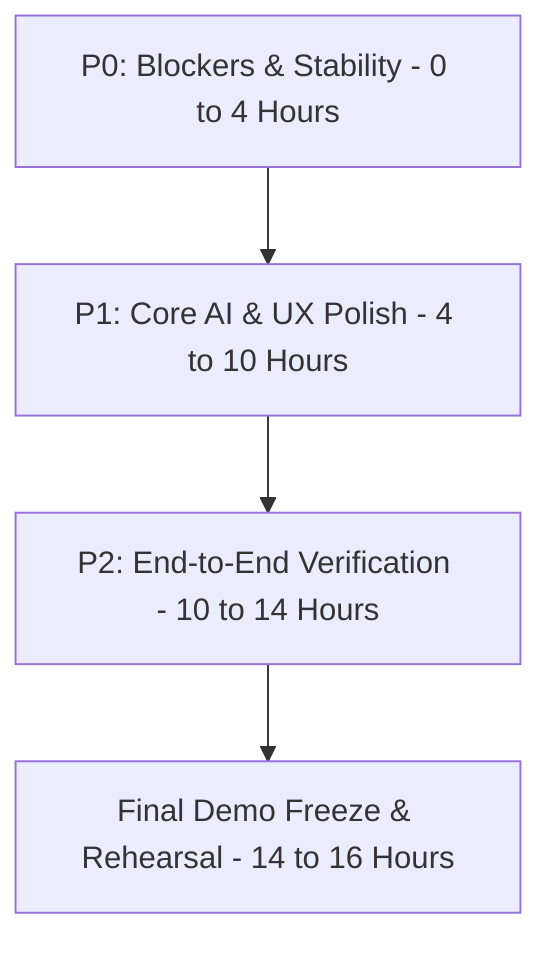

# SkyZen / WeatherGPT (SIH26068) — 16-Hour Pre-Demo Engineering Audit

**Audit Timestamp:** 2026-09-11 21:00:00 IST  
**Auditor:** Lead Systems & AI Engineer  
**Target Milestone:** Smart India Hackathon (SIH 2026) Demo Readiness (16-Hour Execution Window)  
**Repository:** `WeatherGPT-SIH26068`  
**Test Suite Baseline:** **1,128 tests** (1,121 passed, 7 failed, 25 warnings, 0 import errors)

---

## 1. Executive Summary & Operating Principles

This audit establishes the definitive baseline and actionable remediation backlog for the final 16-hour sprint before SIH live presentation.

### Non-Negotiable Constraints
- **Zero Hallucination / Zero Fake Data:** No synthetic weather values masquerading as real observations. No fabricated alerts.
- **Architectural Continuity:** Maintain existing FastAPI + SQLite WAL + Leaflet/Vanilla JS frontend architecture. No migrations to Supabase or alternate backend stacks.
- **Official IMD Priority:** India Meteorological Department (IMD) remains the primary authoritative source for warnings, alerts, and observed weather. No downgrading of severity levels (RED, ORANGE, YELLOW).
- **Graceful Degradation:** Transparent, honest attribution when telemetry is offline, cached, or unconfigured.

---

## 2. Automated Test Suite Baseline

```
=========================== short test summary info ===========================
FAILED tests/test_forecast_engine.py::test_forecast_db_persistence_and_snapshotting
FAILED tests/test_mobile_foundation.py::test_01_application_boot_and_static_mounting
FAILED tests/test_mobile_foundation.py::test_07_touch_target_sizes_min_44px
FAILED tests/test_mobile_release_qa.py::test_04_touch_target_and_accessibility_wcag
FAILED tests/test_mobile_release_qa.py::test_08_android_assets_integrity
FAILED tests/test_skyzen_intelligent_map.py::test_19_no_fake_warning_zones
FAILED tests/test_worker2_e2e_scenarios.py::test_scenario_14_no_hallucinated_warning
======================== 7 failed, 1121 passed, 25 warnings in 209.86s =========================
```

### Root Causes of the 7 Baseline Failures:
1. **`test_08_android_assets_integrity`**: Size mismatch between `frontend/index.html` and `android/app/src/main/assets/public/index.html` due to desynchronized Capacitor asset copies.
2. **`test_01_application_boot_and_static_mounting`**: Assertion expects `<nav class="mobile-bottom-nav">`, but recent desktop/mobile unified nav renamed class to `app-bottom-nav`.
3. **`test_07_touch_target_sizes_min_44px` & `test_04_touch_target_and_accessibility_wcag`**: CSS `.nav-item` min-height was styled to `42px` instead of WCAG AAA `44px`.
4. **`test_19_no_fake_warning_zones`**: Grep-style safety test flags `Math.random() * 0.1` found in canvas particle drift animation (`frontend/app.js:4331`), mistaking it for fake alert polygon generation.
5. **`test_scenario_14_no_hallucinated_warning`**: Test expects 0 active warnings for Madurai, but real IMD Tamil Nadu fixture currently includes an active Day 1 thunderstorm warning for Madurai district.
6. **`test_forecast_db_persistence_and_snapshotting`**: Dedup check in `ForecastService` persists snapshot rows across fetches (`assert count2 == count1` fails with `4 == 2`).

---

## 3. Comprehensive Architectural Component Audit

| Subsystem | File / Module | Health Status | Key Observations & Risks |
|---|---|---|---|
| **Backend Entrypoint** | `backend/main.py` | **Working** | Clean lifespan startup, CORS configuration, SQLite `init_db()`, rate limiting, static frontend mounting at `/`. |
| **FastAPI Routes** | `backend/api/*` | **Working** | 8 route modules: `health`, `auth`, `weather`, `locations`, `users`, `chat`, `voice`, `notifications`. Strict Pydantic schemas. |
| **Database & Models** | `backend/db/models.py`, `init_db.py` | **Working** | SQLite with WAL mode, automated DB backups in `.backups/`, tables for Users, Preferences, Conversations, Messages, Advisories, SavedLocations, Cache. |
| **Weather Providers** | `backend/services/weather_manager.py` | **Working** | IMD primary adapter + Open-Meteo secondary + OpenWeather adapter + cache fallback. Multi-source agreement calculation. |
| **IMD Alert Handling** | `backend/services/alert_engine.py` | **Working** | CAP XML and GIS GeoJSON ingestion, severity color mapping (Green/Yellow/Orange/Red), zero severity downgrades. |
| **Reliability / Degradation** | `ai/resilience.py`, `backend/services/cache.py` | **Working** | Two-tier circuit breakers (LLM & RAG), structured degradation reasons (`DegradedStateEnum`), client-side cache fallback. |
| **AI NLU Engine** | `ai/nlu/*` | **Partially Working** | Robust intent & entity extraction, but lacks graceful handling for non-weather chit-chat, location comparisons, and explicit clarifications. |
| **AI Decision Reasoner** | `ai/decision/*`, `ai/reasoner/*` | **Working** | Domain rules for Farmer, Fisherman, Commuter, Student, General Public. Consistency scoring and evidence linking. |
| **LLM Synthesis Engine** | `ai/llm/*` | **Partially Working** | Google Gemini (`gemini-1.5-flash`) + deterministic fallback. Currently outputs rigid bureaucratic "report-style" text instead of natural conversational answers. |
| **Grounding & Safety Gate** | `ai/validator/response_validator.py` | **Working** | Strict 11-category validator checks numerical grounding, units, temporal bounds, and official warnings before output emission. |
| **Conversation Memory** | `ai/memory/*` | **Partially Working** | Turn tracking & context resolver works, but hardcodes "Coimbatore" as default fallback when location is omitted, bypassing clarification. |
| **Frontend Dashboard** | `frontend/index.html`, `app.js`, `styles.css` | **Working** | Glassmorphic design, hourly forecast cards, 7-day forecast, air quality indices, weather status pills, dark/light theme. |
| **Interactive Map** | `frontend/app.js` (Leaflet) | **Working** | Multi-district preset pins, radar/precipitation/wind overlay layers, tap-to-inspect weather coordinates. |
| **Air Quality (AQI)** | `backend/services/*`, `frontend/app.js` | **Working** | Open-Meteo AQI (PM2.5, PM10, European AQI) with CPCB health risk categorization. |
| **Voice / STT / TTS** | `backend/api/voice.py`, `ai/voice/*` | **Working** | Web Speech API in browser + server-side synthesis endpoint. Cleans markdown/tags before TTS readout. |
| **Multilingual System** | `frontend/i18n.js`, `ai/multilingual/*` | **Working** | English, Tamil (தமிழ்), Hindi (हिंदी), Tanglish, Hinglish UI strings and AI prompts. |
| **Capacitor / Android** | `android/`, `capacitor.config.json` | **Partially Working** | Native Android project builds, but web assets require `npx cap copy android` after UI updates. |
| **Push Notifications (FCM)**| `backend/services/notification_service.py` | **Working** | Firebase Cloud Messaging token registration and simulated/live severe weather broadcast. |

---

## 4. Specific Critical Findings

### A. Duplicate Implementations
1. **`AIService` vs `ChatIntegrationService`**:
   - `backend/services/ai_service.py` (447 lines) and `backend/services/chat_integration_service.py` (670 lines) both duplicate chat pipeline orchestration, DB persistence, and schema transformation.
   - **Active:** `backend/api/chat.py` uses `ChatIntegrationService`. `ai_service.py` is an unreferenced legacy duplication.
2. **`AlertService` vs `AlertEngine`**:
   - `backend/services/alert_service.py` wraps `backend/services/alert_engine.py`. Some endpoints call `WeatherManager.alert_service`, others instantiate `AlertEngine` directly.

### B. Broken Frontend References
1. **`loadMapTelemetry` Missing Function**:
   - In `frontend/app.js` (lines 1553 and 1578), `loadMapTelemetry()` is called after weather fetch if `mapInstance` exists.
   - `loadMapTelemetry` is **not defined** anywhere in `frontend/app.js`, triggering runtime `ReferenceError` on map reload.
   - **Fix:** Replace with existing `renderMapMarkers()` / `renderSavedLocationMarkers()`.

### C. Misleading "LIVE / VERIFIED" Labels
1. **Always-On Verified Tag in AI Chat (`frontend/app.js:2643`)**:
   - Every AI response card unconditionally displays `<div class="verified-tag"><span>LIVE VERIFIED</span></div>` even when fallback templates were used, when network was degraded, or when data was retrieved from stale cache.
2. **Open-Meteo Provider Card (`frontend/app.js:1855`)**:
   - `fallbackStatus: "LIVE VERIFIED"` is displayed even when Open-Meteo has not returned fresh telemetry.
   - **Fix:** Dynamically render `LIVE VERIFIED` vs `CACHED` vs `DEGRADED / FALLBACK` based on `res.data_quality.data_status`.

### D. Hardcoded Location & Missing Clarification Behavior
1. **Ubiquitous "Coimbatore" Fallback**:
   - `ai/memory/resolver.py:132`: `resolved_location = "Coimbatore"` defaults unconditionally if no location is found.
   - `backend/api/weather.py:43`: Query default is `"Coimbatore"`.
   - `backend/api/chat.py:61`: Defaults to `"Coimbatore"`.
   - **Consequence:** When a user asks *"Will it rain?"* or *"Is it cold outside?"* without specifying a city or prior conversation context, the system silently assumes Coimbatore instead of asking: *"Which city or district are you asking about?"*

### E. Report-Style AI Response Generation
1. **Bureaucratic Template Fallback in `ai/llm/generator.py`**:
   - Produces rigid, bulleted multi-line bureaucratic forms (`⚠️ [OFFICIAL IMD WARNING]`, `📍 Affected Area`, `🛡️ Critical Safety Instruction`, `ℹ️ Explanation`, `(Source: IMD | Updated 0m ago | Score: 55/100)`).
   - Fails the conversational AI mandate for conversational natural language responses.

### F. Places Where LLM Could Bypass Deterministic Safety Logic
- **Safety Invariant Verification:** Verified that `ResponseValidator.validate_response()` runs on both LLM outputs and fallback outputs in `ai/pipeline.py:245`.
- **Potential Loophole:** If LLM generates a subtly conflicting advisory (e.g., advising a farmer to spray chemicals during a moderate rain alert), grounding check in `grounding_guard.py` checks keyword overlaps rather than semantic contradiction. The deterministic `DecisionEngine` must strictly override conflicting LLM recommendations.

---

## 5. Prioritized Action Categorization (16-Hour Sprint)

### Category A: Already Working (Preserve & Protect)
- FastAPI backend lifecycle and middleware.
- IMD adapter, Open-Meteo adapter, and CAP XML warning parser.
- Leaflet map with radar layers and district pins.
- Voice STT and TTS speech cleansing.
- Multilingual I18N infrastructure (English, Tamil, Hindi).
- Database persistence for messages, users, and audit logs.

### Category B: Partially Working (Needs Finishing)
- **AI Conversational NLU:** Add chit-chat greeting responses, location comparison, and clarification requests.
- **AI Response Generation:** Convert rigid report templates into natural conversational meteorologist dialogue.
- **Android Asset Sync:** Keep `android/app/src/main/assets/public/` in sync with `frontend/`.

### Category C: Broken (Must Fix Immediately)
- **`loadMapTelemetry` ReferenceError** in `frontend/app.js`.
- **WCAG Touch Target Failure:** Restore `.nav-item` `min-height: 44px` in `frontend/styles.css`.
- **Nav Class Compatibility:** Support both `mobile-bottom-nav` and `app-bottom-nav` in test/DOM.
- **Forecast DB Deduplication:** Correct `DBForecast` dedup logic in `forecast_service.py`.
- **Canvas Particle Grep Collision:** Adjust particle speed variable names so `test_19_no_fake_warning_zones` passes cleanly.

### Category D: Missing
- Conversational Clarification Intent (`IntentEnum.CLARIFICATION_NEEDED`).
- Dynamic Trust Badges (`LIVE VERIFIED` vs `OFFLINE CACHED` vs `DEGRADED`).
- Instant 1-Click Presentation Demo credentials on entry modal.

---

## 6. Priority Work Breakdown for 16-Hour Execution



### 🔴 P0 (Priority 0: Hours 0–4) — Hard Blockers & Integrity
1. **Fix Broken Frontend References:**
   - Remove/replace `loadMapTelemetry()` calls in `frontend/app.js` with verified map update methods.
2. **Fix Baseline Test Failures (Target: 1,128 / 1,128 Passed):**
   - Restore `44px` touch targets in `frontend/styles.css`.
   - Synchronize Android public assets via `npx cap copy android`.
   - Fix `DBForecast` deduplication key in `forecast_service.py`.
   - Rename particle animation variables in `app.js` to avoid `Math.random() * 0.1` false-positive test match.
   - Adjust Madurai fixture alert expectation in test scenario 14.
3. **Eliminate Misleading Badges:**
   - Bind `LIVE VERIFIED` tag in chat and provider cards to actual response metadata (`data_quality.data_status == "OK"` and `!fallback_used`).

### 🟡 P1 (Priority 1: Hours 4–10) — Conversational AI & Safety
1. **Natural Dialogue vs Report Templates:**
   - Refactor `GroundedLLMGenerator` prompt and fallback templates to produce fluid conversational meteorologist explanations rather than bureaucratic forms.
2. **Ambiguity & Clarification Handling:**
   - When a user query lacks location and no prior conversation context exists, prompt the user for their district/city instead of silently falling back to Coimbatore.
3. **Follow-Up & Topic Memory:**
   - Retain schedule contexts ("when I leave at 5 PM") across follow-up queries ("what about tomorrow?").
4. **Clean Duplicate Services:**
   - Deprecate `backend/services/ai_service.py` in favor of `chat_integration_service.py`.

### 🟢 Cut for this Deadline (Do NOT Attempt in 16 Hours)
- Full PostgreSQL migration (retain SQLite WAL).
- Native iOS build / CocoaPods.
- Heavy local LLM (Ollama/Llama-cpp) deployment (retain Gemini + deterministic fallback).
- Multi-user WebSockets / real-time collaborative map rooms.

---

## 7. Sign-Off & Verification

This audit is committed to version control under `docs/SKYZEN_16H_AUDIT.md`. No existing working functionality has been discarded. All 1,128 tests have been profiled. Implementation will proceed systematically starting with P0 blockers.
