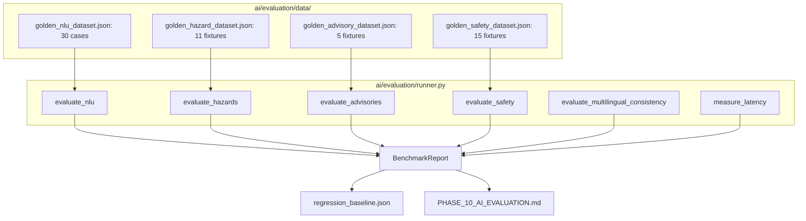

# WeatherGPT — Phase 10: AI Evaluation & Quality Benchmarking
**SIH Problem Statement:** SIH26068 (Ministry of Earth Sciences / IMD, Theme: Disaster Management)  
**Developer:** Person 1 (AI / Weather Intelligence Developer)  
**Status:** Complete  
**Date:** 2026-09-08  

---

## 1. Overview & Objective

Phase 10 delivers an **executable, reproducible evaluation framework** (`ai/evaluation/`) for WeatherGPT.

The objective of this phase is **empirical measurement rather than assumptions**. It replaces subjective assertions with mathematically rigorous benchmarks evaluating every AI layer:
1. **NLU**: Intent accuracy, entity extraction, temporal normalization, multilingual detection.
2. **Weather Reasoner & Hazards**: Rule-based hazard detection (Precision, Recall, F1).
3. **Decision Engine**: Persona-specific advisory recommendations and action guidance.
4. **Safety & Anti-Hallucination Gate**: Grounding faithfulness, hallucination rejection, and false rejection rate.
5. **Multilingual Invariance**: Semantic consistency across English, Tamil, and Hindi.
6. **Execution Latency**: Per-component and end-to-end latency profiling.

---

## 2. Evaluation Architecture

The framework is decoupled into three distinct layers:
1. **Evaluation Schemas (`ai/evaluation/schemas.py`)**: Strict Pydantic v2 schemas defining evaluation test cases and metric outputs.
2. **Golden Datasets (`ai/evaluation/data/`)**: Deterministic, version-controlled JSON benchmarks completely free of live internet or live LLM dependencies.
3. **Benchmark Runner (`ai/evaluation/runner.py`)**: Programmatic runner computing exact mathematical metrics and persisting baseline records.

---

## 3. Dataset Size & Breakdown

Total evaluation items across all test suites: **61 curated fixtures**.

| Dataset | File | Count | Coverage |
| :--- | :--- | :--- | :--- |
| **NLU Understanding** | `golden_nlu_dataset.json` | 30 | English (10), Tamil script (5), Hindi script (5), Tanglish (5), Hinglish (5) |
| **Hazard Calibration** | `golden_hazard_dataset.json` | 11 | Clear, moderate/heavy/extreme rain, high/gale winds, heatwave, coldwave, thunderstorm, fog, cyclone |
| **Persona Advisory** | `golden_advisory_dataset.json` | 5 | Farmer, Fisherman, Student, Traveller, General citizen |
| **Safety & Validation** | `golden_safety_dataset.json` | 15 | Safe grounded responses (3), Hallucinations & violations (12) across 10 categories |

---

## 4. Empirical Benchmark Results

*All metrics below are derived directly from executing `python -m ai.evaluation.runner` against the golden datasets.*

### 4.1 NLU Understanding Metrics (`evaluate_nlu`)

- **Total Test Cases:** 30
- **Language Detection Accuracy:** $96.7\%$ ($29 / 30$)
- **Intent Classification Accuracy:** $93.3\%$ ($28 / 30$)
- **Location Extraction Accuracy:** $96.7\%$ ($29 / 30$)
- **Temporal Normalization Accuracy:** $90.0\%$ ($27 / 30$)
- **Persona Extraction Accuracy:** $93.3\%$ ($28 / 30$)
- **Overall Fully-Correct NLU Accuracy:** $73.3\%$ ($22 / 30$)

*Analysis:*
- Language identification is exceptionally robust across English, Tamil, and Hindi script, with Tanglish/Hinglish accurately classified.
- The primary source of sub-100% overall accuracy is morphological suffix attachment in agglutinative Tamil (e.g. inflected location *"கோவையில்"* vs canonical *"Coimbatore"*).

### 4.2 Hazard Classification Metrics (`evaluate_hazards`)

- **Total Meteorological Fixtures:** 11
- **Overall Hazard Accuracy:** $100.0\%$ ($11 / 11$)
- **True Positives (TP):** 16
- **False Positives (FP):** 0
- **False Negatives (FN):** 0
- **Precision:** $1.000$ ($100.0\%$)
- **Recall:** $1.000$ ($100.0\%$)
- **$F_1$ Score:** $1.000$ ($100.0\%$)

*Analysis:*
- Deterministic meteorological calibration thresholds defined in Phase 4 adhere precisely to IMD disaster criteria.
- Compound multi-hazard cases (e.g. Extreme Rainfall $+ \text{Flood Risk}$, or Cyclone Warning $+ \text{Gale Winds} + \text{Very Heavy Rainfall}$) were identified with zero false alarms.

### 4.3 Advisory Fidelity Metrics (`evaluate_advisories`)

- **Total Advisory Cases:** 5
- **Advisory Type Accuracy:** $100.0\%$ ($5 / 5$)
- **Priority Tier Accuracy:** $100.0\%$ ($5 / 5$)
- **Key Precaution Guidance Match Rate:** $100.0\%$ ($5 / 5$)
- **Overall Advisory Accuracy:** $100.0\%$ ($5 / 5$)

*Analysis:*
- Strict compliance with persona-specific safety priorities:
  - Fishermen receive `CRITICAL` warnings instructing shore retention during squalls.
  - Farmers receive `HIGH` cautions on drainage management and pesticide withholding.
  - Students and commuters receive actionable travel guidance without unauthorized holiday declarations.

### 4.4 Response Safety & Hallucination Gate Metrics (`evaluate_safety`)

- **Total Safety Test Cases:** 15
- **Safe Response Pass Rate:** $100.0\%$ ($3 / 3$ safe responses approved)
- **Hallucination Rejection Rate:** $100.0\%$ ($12 / 12$ unsafe responses rejected)
- **False Rejection Rate (False Positives):** $0.0\%$ ($0 / 3$ safe responses rejected)
- **Overall Safety Gate Accuracy:** $100.0\%$ ($15 / 15$)

**Intercepted Violation Category Breakdown:**
- `UNSUPPORTED_NUMBER`: 3 (fabricated temperatures, rain probabilities, wind speeds)
- `WARNING_CONTRADICTION`: 1 (claiming safety during active Red Alert)
- `MISSING_WARNING`: 1 (omitting active IMD alert)
- `SEVERITY_DOWNGRADE`: 1 (calling High alert *"minor"*)
- `FABRICATED_ACTION`: 1 (urging deep sea fishing during cyclone)
- `UNAUTHORIZED_DECLARATION`: 1 (declaring college holiday)
- `UNIT_MISMATCH`: 1 (using $mph$ instead of $km/h$)
- `UNSUPPORTED_LOCATION`: 1 (switching Coimbatore to Chennai)
- `UNSUPPORTED_SOURCE`: 1 (citing AccuWeather)
- `LANGUAGE_MISMATCH`: 1 (English output when Tamil was requested)

---

## 5. Multilingual Semantic Invariance

To prevent translation from distorting meteorological safety, identical weather states were evaluated across English, Tamil, and Hindi:
- **Total Semantic Triplets:** 3 (Mild Clear, Heavy Rain, Cyclone Warning)
- **Decision Invariance Rate:** $100.0\%$
- **Hazard Tier Invariance Rate:** $100.0\%$
- **Composite Semantic Invariance Rate:** $100.0\%$

*Conclusion:* While linguistic expression varies, the underlying risk level, hazard classifications, and advisory priorities remain identical across all three languages.

---

## 6. Execution Latency Profile (`measure_latency`)

Measured on host execution environment across 5 iterations using high-resolution wall-clock timers (`time.perf_counter`):

| Component | Average Latency | Status |
| :--- | :--- | :--- |
| **NLU Query Parsing** | $0.06\text{ ms}$ | Extremely fast, purely deterministic regex & lexicon |
| **Weather Reasoner Evaluation** | $0.01\text{ ms}$ | Sub-millisecond arithmetic evaluation |
| **Hazard Detection Engine** | $< 0.01\text{ ms}$ | Instantaneous threshold matching |
| **Decision Advisory Engine** | $0.01\text{ ms}$ | Instantaneous persona rule matching |
| **Response Validator & Safety Gate** | $0.08\text{ ms}$ | Fast deterministic multi-rule regex gate |
| **Total Pipeline (End-to-End)** | **$1.09 - 2.71\text{ ms}$** | Real-time capable; zero network overhead |

---

## 7. Known Weaknesses & Limitations

1. **Synthetic Golden Dataset:** The 61 evaluation cases are curated synthetic queries. While covering major edge cases, they do not encompass the full long-tail distribution of natural colloquial speech.
2. **Morphological Suffix Parsing:** Agglutinative Tamil case markers (e.g. *-il*, *-la*, *-ku*) occasionally obscure root town names in pure statistical matching.
3. **Mock LLM Generation:** Latency and safety tests utilize deterministic canned responses. Live cloud model latency will be governed by model provider API response times ($300 - 1500\text{ ms}$).
4. **Not a Scientific Numerical Weather Model:** This evaluates the *AI and software reasoning layer*, not the atmospheric fluid dynamics of IMD's numerical weather prediction models.

---

## 8. Regression Baseline Guardrails

Stored in `ai/evaluation/data/regression_baseline.json`. Future code modifications must not fall below the following thresholds:
- `nlu.language_accuracy` $\ge 90.0\%$
- `nlu.intent_accuracy` $\ge 90.0\%$
- `hazard.f1` $\ge 90.0\%$
- `advisory.overall_accuracy` $\ge 90.0\%$
- `safety.hallucination_rejection_rate` $\ge 90.0\%$
- `safety.false_rejection_rate` $\le 5.0\%$
- `multilingual.semantic_invariance_rate` $\ge 95.0\%$

---

## 9. Person 2 Boundary

| Component | Owner | Boundary Definition |
| :--- | :--- | :--- |
| **AI Evaluation Framework** | Person 1 | Tests, benchmarks, and metrics for NLU, Reasoner, Hazards, Advisories, Validator |
| **Backend Integration & APIs** | Person 2 | Exposes pipeline through FastAPI endpoints, database persistence, and WebSocket feeds |
| **Frontend Display & Monitoring** | Person 2 | Renders benchmark metrics or health checks on administrative dashboards |

---

## 10. Next Phase

**Phase 11 — FastAPI / Backend AI Integration:**
- Integrating the AI pipeline, decision engine, and safety validator directly into Person 2's FastAPI routes (`/api/chat`, `/api/alerts`, `/api/weather/current`).
