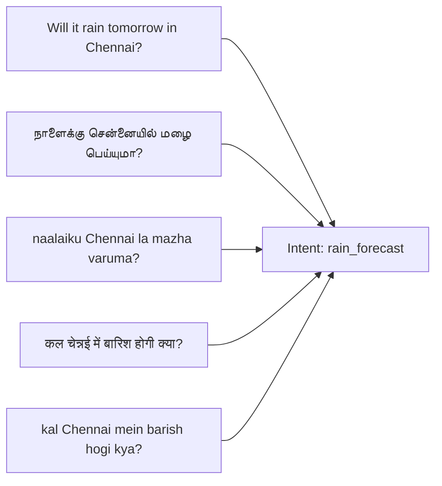

# WeatherGPT — Phase 2: NLU Depth & Multilingual Query Understanding
**SIH Problem Statement:** SIH26068 (Ministry of Earth Sciences / IMD, Theme: Disaster Management)  
**Developer:** Person 1 (AI / Weather Intelligence Developer)  
**Status:** Complete  
**Date:** 2026-09-08  

---

## 1. Overview & Objective

Phase 2 deepens and hardens the Natural Language Understanding (NLU) layer (`ai/nlu/`) to convert real-world, natural weather queries into structured queries for the downstream Weather Reasoner. It adds robust support for:
* **English** (Standard conversational weather inquiries)
* **Tamil** (Native Tamil script with inflected case endings: `-இல்`, `-க்கு`)
* **Tanglish** (Tamil phonetic transliteration in Latin script with locative suffixes: `-la`, `-le`)
* **Hindi** (Native Devanagari script)
* **Hinglish** (Hindi phonetic transliteration in Latin script with postpositions: `mein`, `ka`, `ki`)
* **Relative Date & Time Parsing** (`today`, `tomorrow`, `day after tomorrow`, `yesterday`, `this weekend`, `next week`, normalized time periods `morning`, `afternoon`, `evening`, `night`)
* **Explicit Ambiguity Detection** (flags queries where location is missing to prevent hallucinated cities)

---

## 2. Supported Languages & Modalities

| Language Enum | Script / Style | Example Queries |
| :--- | :--- | :--- |
| `LanguageEnum.EN` | Latin (English) | *"What is the weather in Coimbatore?"*, *"Will it rain tomorrow in Chennai?"* |
| `LanguageEnum.TA` | Tamil script | *"நாளைக்கு கோயம்புத்தூரில் மழை வருமா?"*, *"சென்னையில் இன்று வானிலை எப்படி?"* |
| `LanguageEnum.TANGLISH` | Latin (Tamil phonetics) | *"naalaiku Coimbatore la mazha varuma?"*, *"coimbatore la inniku weather epdi?"*, *"naalaiku college pogalama?"* |
| `LanguageEnum.HI` | Devanagari script | *"कल चेन्नई में बारिश होगी क्या?"*, *"आज दिल्ली का मौसम कैसा है?"* |
| `LanguageEnum.HINGLISH` | Latin (Hindi phonetics) | *"kal Chennai mein barish hogi kya?"*, *"aaj Delhi ka weather kaisa hai?"*, *"kal subah Chennai mein weather kaisa rahega?"* |

---

## 3. Query Normalization (`ai/nlu/normalization.py`)

A deterministic normalization step canonicalizes common phonetic spelling variations without altering original query text:
* `naalaikku` / `nalaiku` $\to$ `naalaiku`
* `inniku` / `innaiku` $\to$ `inniku`
* `mazha` / `malai` $\to$ `mazhai`
* `baarish` / `barsaat` $\to$ `barish`
* `mosam` $\to$ `mausam`
* `epdi` $\to$ `eppadi`
* `kovai` $\to$ `coimbatore`

The result is saved in `NLUResult.normalized_text`, while `NLUResult.original_text` preserves the raw user input verbatim.

---

## 4. Canonical Intent Equivalence

All languages and transliterations map to unified canonical semantic intents:



---

## 5. Relative Date & Time Range Normalization

| Raw Term | Extracted Date | Normalized Time Range |
| :--- | :--- | :--- |
| `morning` / `kaalai` / `subah` / `காலை` / `सुबह` | — | `06:00-12:00` |
| `afternoon` / `madhiyam` / `dophar` / `மதியம்` / `दोपहर` | — | `12:00-17:00` |
| `evening` / `maalai` / `shaam` / `மாலை` / `शाम` | — | `17:00-21:00` |
| `night` / `iravu` / `raat` / `இரவு` / `रात` | — | `21:00-06:00` |
| `today` / `inniku` / `aaj` / `இன்று` / `आज` | `today` | — |
| `tomorrow` / `naalaiku` / `kal` / `நாளை` / `कल` | `tomorrow` | — |
| `day after tomorrow` / `parso` / `நாளை மறுநாள்` / `परसों` | `day after tomorrow` | — |
| `yesterday` / `netru` / `beeta kal` / `நேற்று` | `yesterday` | — |

---

## 6. Location Extraction & Ambiguity Handling

* **Indic Scripts:** Script-aware substring and case-inflection matching correctly extracts `Coimbatore` from inflected forms like `"கோயம்புத்தூரில்"` and `Delhi` from `"दिल्ली में"`.
* **Ambiguity Detection:** If a user query requires location (e.g. *"Will it rain tomorrow?"*) but omits it, the NLU explicitly sets:
  ```json
  {
    "entities": {"location": null},
    "ambiguity": "Location not specified in query."
  }
  ```
  This guarantees that downstream systems do not fabricate a random city.

---

## 7. Structured NLU Contract (`NLUResult`)

```python
NLUResult(
    original_text="kal Chennai mein barish hogi kya?",
    normalized_text="kal chennai mein barish hogi kya?",
    detected_language=LanguageEnum.HINGLISH,
    intent=IntentEnum.RAIN_FORECAST,
    entities=ExtractedEntities(
        location="Chennai",
        date="tomorrow",
        time=None,
        time_range=None,
        weather_variable="rainfall",
        hazard=None,
        persona=None,
        activity=None
    ),
    confidence=0.92,
    ambiguity=None
)
```

---

## 8. Test Verification & Results

Executed full regression suite:
```powershell
python -m pytest -v
```
Results:
* **Total Tests:** 29 (17 baseline + 5 Phase 1 + 7 new Phase 2 depth tests)
* **Passed:** 29 (100%)
* **Execution Time:** ~0.23s
