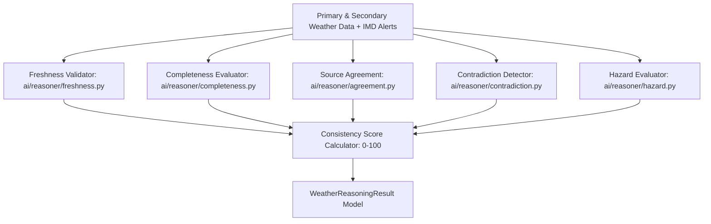

# WeatherGPT — Phase 3: Weather Reasoner & Data Consistency Intelligence
**SIH Problem Statement:** SIH26068 (Ministry of Earth Sciences / IMD, Theme: Disaster Management)  
**Developer:** Person 1 (AI / Weather Intelligence Developer)  
**Status:** Complete  
**Date:** 2026-09-08  

---

## 1. Overview & Objective

Phase 3 strengthens and formalizes the **Weather Reasoner** (`ai/reasoner/`), the core meteorological intelligence layer of WeatherGPT. The reasoner does **not** generate speculative weather forecasts; instead, it deterministically evaluates structured observations, forecasts, and official IMD warnings supplied by the backend/data layer to establish:
1. **Data Freshness:** Elapsed observation age and staleness thresholds.
2. **Data Completeness:** Verification of essential variables without hallucinating missing fields.
3. **Multi-Source Agreement & Disagreement:** Comparing overlapping parameters (rain probability, temperature, wind speed) between primary (IMD) and secondary (Open-Meteo) sources.
4. **Contradiction Detection:** Flagging severe divergences, unphysical swings, and local clear skies during active severe weather alerts.
5. **Forecast Consistency Score:** An application-level data reliability metric ($0\text{–}100$).
6. **Authoritative Warning Priority:** Unconditionally preserving and prioritizing official IMD warnings over generic conditions or AI-detected risks.

---

## 2. Architecture & Pipeline



---

## 3. Data Completeness & Missing Data Safety

`ai/reasoner/completeness.py` verifies required observation parameters:
* `location`, `observed_at`, `temperature`, `humidity`, `rain_probability`, `wind_speed`, `weather_condition`.
* If data is missing or `primary_weather` is `None`:
  * `data_complete = False`
  * `missing_fields = [...]`
  * `consistency_score = 0`
  * **Critical Safety Guarantee:** Unknown data is **never** coerced into "0% rain" or "Safe". Unknown remains explicitly unknown.

---

## 4. Multi-Source Agreement & Disagreement

When primary (IMD) and secondary (Open-Meteo) data are available, `ai/reasoner/agreement.py` evaluates metric differences:

| Metric | High Agreement | Moderate Agreement | Low Agreement (Disagreement) |
| :--- | :--- | :--- | :--- |
| **Rain Probability** | $\Delta \le 20\%$ | $\Delta \le 40\%$ | $\Delta > 40\%$ |
| **Temperature** | $\Delta \le 3^\circ\text{C}$ | $\Delta \le 5^\circ\text{C}$ | $\Delta > 5^\circ\text{C}$ |
| **Wind Speed** | $\Delta \le 15\text{ km/h}$ | $\Delta \le 30\text{ km/h}$ | $\Delta > 30\text{ km/h}$ |

---

## 5. Contradiction Detection (`ai/reasoner/contradiction.py`)

1. **Multi-Source Conflicts:** Severe divergence (e.g. $\Delta \text{rain} \ge 50\%$ or $\Delta \text{temp} \ge 6^\circ\text{C}$).
2. **Authoritative Warning Override:** When generic sky observation reports "Sunny/Clear" while an active IMD alert (Cyclone, Heavy Rain, Thunderstorm) is in force, the contradiction detector flags an override:
   > *"Authoritative Warning Override: Local condition is reported as 'Sunny', but official IMD alert is active. Official warning takes precedence."*
3. **Forecast Internal Incoherency:** Rapid unphysical shifts (e.g. $\ge 15^\circ\text{C}$ temperature jump within 1 hour).

---

## 6. Forecast Consistency Score Semantics

The composite **Forecast Consistency Score** ($0\text{–}100$) represents data quality and multi-source alignment:
* **Source Agreement:** Up to 35 pts (35 for High, 30 for Single Authoritative IMD Source, 5 for Low).
* **Data Freshness:** Up to 25 pts (Fresh: 25, Acceptable: 18, Stale: 5).
* **Data Completeness:** Up to 25 pts (Complete: 25, Incomplete: 10).
* **Authoritative Warning Clarity:** Up to 15 pts (Active IMD alert clarifies hazard status).
* **Contradiction Penalty:** Subtracts 10–25 pts when strong contradictions are detected.

> [!IMPORTANT]
> This metric is strictly labelled **Forecast Consistency Score** or **Data Confidence Indicator**. It is **never** presented to users as a scientific probability of rainfall.

---

## 7. Authoritative Warning Separation & Priority

`WeatherReasoningResult` explicitly separates:
* `active_warnings`: Authoritative alerts directly from IMD (Red, Orange, Yellow).
* `ai_detected_hazards`: Hazards inferred from observation thresholds (e.g. winds $\ge 40\text{ km/h}$).

If an official alert exists, the overall risk level unconditionally mirrors the alert severity, regardless of calm local conditions.

---

## 8. Test Verification & Results

Command run:
```powershell
python -m pytest -v
```
Results:
* **Total Tests:** 53 across repository (29 baseline + 10 Phase 3 Reasoner tests + 14 Person 2 tests)
* **Passed:** 53 (100%)
* **Execution Time:** ~6.39s
