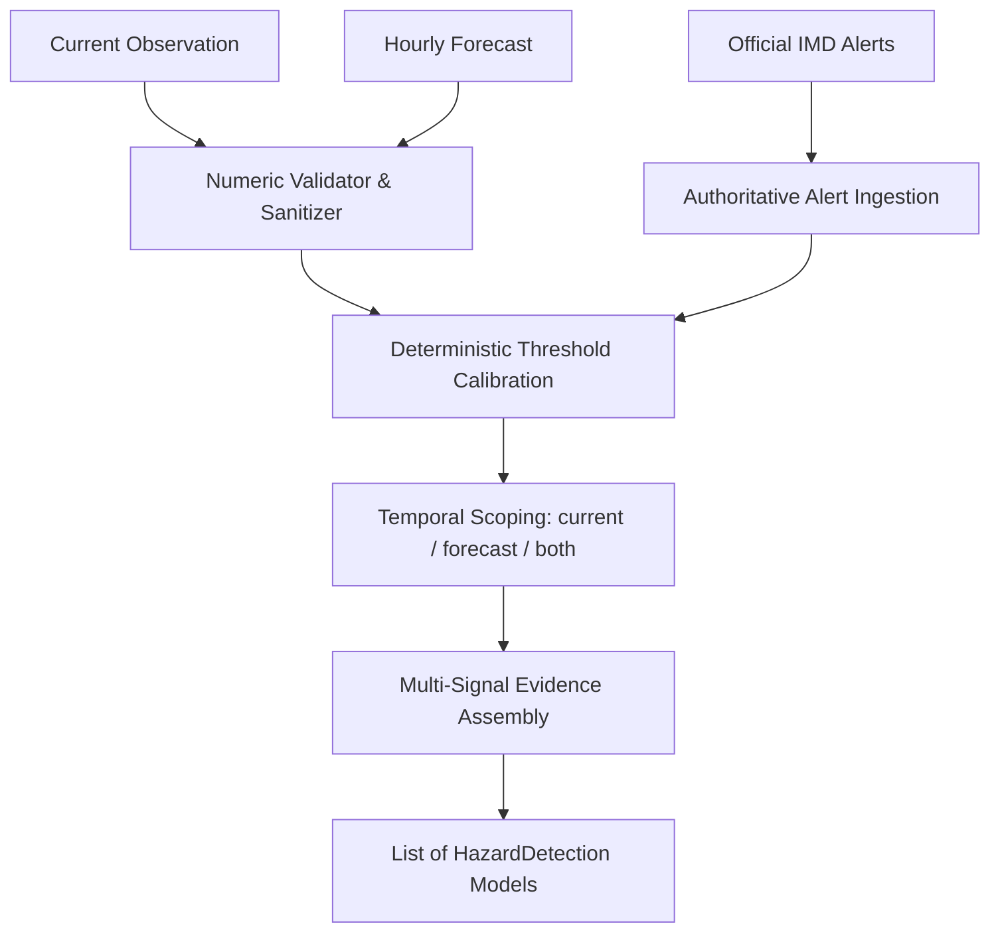

# WeatherGPT — Phase 4: Hazard Detection & Calibration
**SIH Problem Statement:** SIH26068 (Ministry of Earth Sciences / IMD, Theme: Disaster Management)  
**Developer:** Person 1 (AI / Weather Intelligence Developer)  
**Status:** Complete  
**Date:** 2026-09-08  

---

## 1. Overview & Architecture

Phase 4 formalizes and calibrates the **Hazard Detection Layer** within the Weather Reasoner (`ai/reasoner/hazard.py`). 

The hazard layer is a deterministic, explainable, unit-aware system that analyzes normalized meteorological observations, forecasts, and official IMD warnings. It does **not** generate persona advisories or speculative weather forecasts; rather, it produces machine-readable hazard assessments and structured evidence consumed by downstream AI stages (`ai/decision/` and `ai/validator/`).



---

## 2. Supported Hazards & Identifiers

| Hazard Identifier | Physical Trigger / Criterion | Calibrated Severity | Classification Basis |
| :--- | :--- | :--- | :--- |
| `EXTREME_RAINFALL` | $\ge 204.5\text{ mm}$ (24h accumulation) | `EXTREME` | Official IMD Criteria |
| `VERY_HEAVY_RAINFALL`| $115.6\text{ mm} \le r < 204.5\text{ mm}$ | `HIGH` | Official IMD Criteria |
| `HEAVY_RAINFALL` | $64.5\text{ mm} \le r < 115.6\text{ mm}$ OR rain prob $\ge 80\%$ | `HIGH` | IMD Rainfall / Application Threshold |
| `MODERATE_RAINFALL` | $15.6\text{ mm} \le r < 64.5\text{ mm}$ OR rain prob $\ge 60\%$ | `MEDIUM` | IMD Rainfall / Application Threshold |
| `GALE_CYCLONIC_WINDS`| Wind speed $\ge 62.0\text{ km/h}$ (Gale/Squall) or $\ge 88\text{ km/h}$ | `EXTREME` | Official IMD Squall/Gale Standard |
| `STRONG_WINDS` | $40.0\text{ km/h} \le w < 62.0\text{ km/h}$ | `HIGH` | Application Strong Wind Threshold |
| `HEATWAVE` | Temp $\ge 40.0^\circ\text{C}$ (Plains threshold); $\ge 45.0^\circ\text{C}$ (Severe) | `HIGH` / `EXTREME` | IMD Plains Heatwave Criteria |
| `COLDWAVE` | Temp $\le 10.0^\circ\text{C}$ (Plains threshold); $\le 4.0^\circ\text{C}$ (Severe) | `MEDIUM` / `HIGH` | IMD Plains Coldwave Criteria |
| `THUNDERSTORM_LIGHTNING`| Condition keywords: "thunder", "lightning", "squall" | `HIGH` | IMD Convective Storm Indicator |
| `LOW_VISIBILITY` | Condition keywords: "dense fog" ($<200\text{m}$) or "fog"/"smog" | `HIGH` / `MEDIUM` | Transport & Aviation Safety Threshold |
| `FLOOD_RISK` | Rainfall $\ge 115.6\text{ mm}$ or inundation / waterlogging condition | `HIGH` / `EXTREME` | Hydrological Impact Assessment |
| `OFFICIAL_WARNING_<TYPE>`| Direct active alert from IMD (`OfficialAlert`) | Alert Severity | Unconditional Authoritative Override |

---

## 3. Threshold Calibration & Units

All calculations enforce explicit units:
- **Temperature:** Celsius ($^\circ\text{C}$)
- **Wind Speed:** Kilometers per hour ($\text{km/h}$)
- **Rainfall Amount:** Millimeters ($\text{mm}$)
- **Precipitation Probability:** Percentage ($0\text{–}100\%$)
- **Visibility:** Meters ($\text{m}$)

> [!NOTE]
> Rainfall thresholds ($15.6\text{ mm}$, $64.5\text{ mm}$, $115.6\text{ mm}$, $204.5\text{ mm}$), gale wind thresholds ($\ge 62\text{ km/h}$, $\ge 88\text{ km/h}$), and temperature thresholds ($40^\circ\text{C}$ heatwave, $10^\circ\text{C}$ coldwave) directly implement authoritative Indian Meteorological Department (IMD) disaster standards. Precipitation probability criteria ($60\%$, $80\%$) are clearly designated as **Application Thresholds**.

---

## 4. Authoritative Warning Priority

Official IMD warnings (`active_alerts`) unconditionally supersede local sensor readings and model predictions:
1. **No Downgrading:** The hazard engine never downgrades, cancels, or dismisses an official alert.
2. **Override Priority:** If local observation reports "Sunny/Clear" or $5\text{ km/h}$ wind, but an active Red Alert Cyclone warning is in force:
   - The alert is retained as an active hazard with `is_official_warning = True` and severity `EXTREME`.
   - `WeatherReasoner.overall_risk` unconditionally mirrors the official alert severity.
3. **Strict Separation:** `WeatherReasoningResult.ai_detected_hazards` only contains model-derived hazards, while `WeatherReasoningResult.active_warnings` contains authoritative alerts.

---

## 5. Temporal Hazard Scoping (Current vs. Forecast)

`HazardDetection` includes an explicit `current_or_forecast` field (`"current"`, `"forecast"`, or `"both"`):
- **Current Observation:** If current rain probability is $85\%$ but forecast tapers off, it is tagged as `"current"`.
- **Forecast Hazard:** If current conditions are calm ($15\text{ km/h}$ wind), but a gale of $65\text{ km/h}$ is predicted at 21:00, it is tagged as `"forecast"` with evidence recording the future timestamp.
- **Persistent Hazard:** If strong winds are present currently and sustained through forecast periods, it is tagged as `"both"`.

---

## 6. Machine-Readable Evidence Model

Every hazard generated provides an `evidence: List[str]` to enable transparent, explainable grounding for downstream LLM prompts and decision engines:

```json
{
  "hazard_type": "HEAVY_RAINFALL",
  "detected": true,
  "severity": "high",
  "details": "High probability of heavy precipitation (90%, 80.0 mm).",
  "evidence": [
    "Current observed rainfall 80.0 mm",
    "Current precipitation probability 90%",
    "Forecast peak rainfall 65.0 mm at 18:00"
  ],
  "source": "IMD",
  "is_official_warning": false,
  "current_or_forecast": "both"
}
```

---

## 7. False-Positive Controls & Safe Numeric Sanitization

1. **False-Positive Suppression:** Normal weather (e.g. $28^\circ\text{C}$, $15\%$ rain probability, $12\text{ km/h}$ wind, "Partly Cloudy") produces zero false hazards. Gentle drizzle ($5\text{ mm}$, $35\%$ rain prob) does not trigger severe alarms.
2. **Numeric Validation (`_is_valid_num`):** Rejects `NaN`, `Inf`, negative wind speeds, negative rainfall, and impossible percentages ($> 100\%$ or $< 0\%$). Sensor glitches and corrupted telemetry cannot cause false hazard triggers.
3. **Missing Data Safety:** If an observation record or individual field is missing (`None`), the hazard engine treats it as unavailable and does not assume safety or danger.

---

## 8. Integration Boundaries

- **Person 2 Data Layer:** Provides normalized `WeatherRecord`, `ForecastItem`, and `OfficialAlert`. The hazard engine is completely decoupled from database queries, raw JSON parsing, or HTTP network requests.
- **Pipeline & Decision Layer:** Downstream modules (`ai/decision/`, `ai/rag/`, `ai/validator/`) receive `WeatherReasoningResult` with structured `detected_hazards` and `ai_detected_hazards`. Persona advice (students, fishermen, farmers) is generated in Phase 5 / Phase 6, not here.

---

## 9. Test Verification Results

All 72 repository tests pass cleanly:
```powershell
python -m pytest -v
======================== 72 passed, 1 warning in 8.84s ========================
```
Covering:
- 19 new hazard calibration & depth tests in `tests/test_ai_hazard_depth.py`
- 10 Phase 3 reasoner depth tests in `tests/test_ai_reasoner_depth.py`
- 13 Phase 1 & 2 NLU depth tests in `tests/test_ai_nlu_depth.py`
- 16 Core AI pipeline and decision tests in `tests/test_ai_core.py` and `tests/test_ai_pipeline.py`
- 14 Backend FastAPI, database, and weather adapter tests from Person 2

---

## 10. Next Recommended Phase

**Phase 5 — LLM Integration & Grounded Response Layer:** Grounded prompt construction, LLM provider integration, strict fallback execution, and domain safety prompt engineering.
