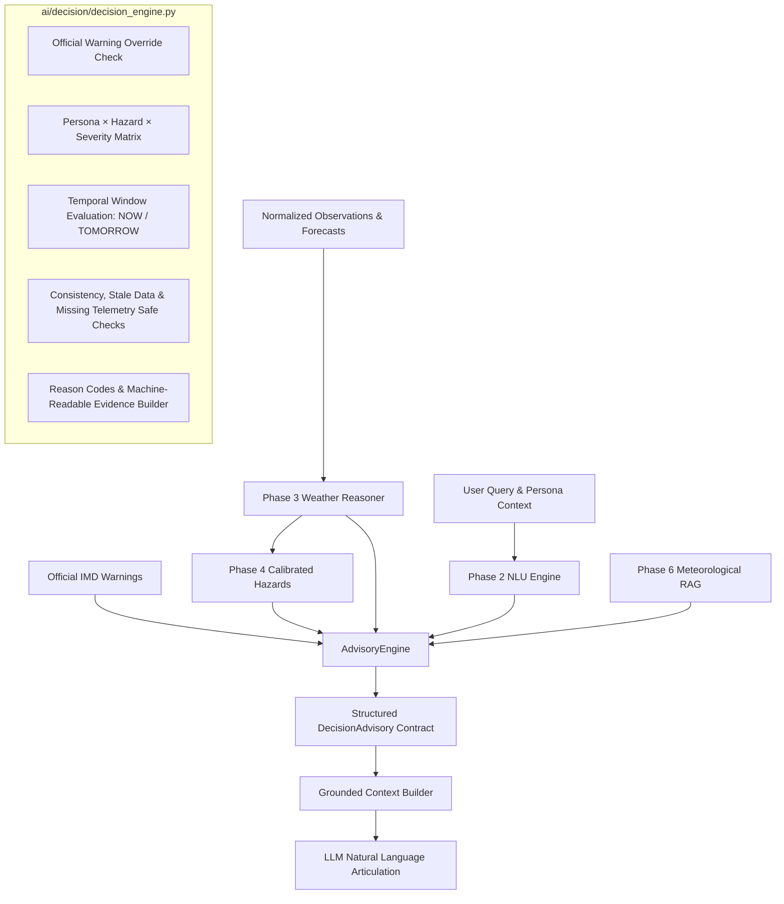

# WeatherGPT — Phase 7: Advisory / Decision Engine
**SIH Problem Statement:** SIH26068 (Ministry of Earth Sciences / IMD, Theme: Disaster Management)  
**Developer:** Person 1 (AI / Weather Intelligence Developer)  
**Status:** Complete  
**Date:** 2026-09-08  

---

## 1. Overview & Objectives

Phase 7 establishes the **Persona-Aware Advisory & Decision Engine** (`ai/decision/`) for WeatherGPT.

The primary objective is to convert verified meteorological intelligence (real-time telemetry, numerical forecasts, data consistency scores, deterministic hazard detections, and official IMD warnings) into **conservative, actionable, persona-tailored advice**.



### Fundamental Division of Responsibility
- **The Advisory Engine decides:** **WHAT** kind of advice is appropriate (advisory type, action priority, temporal window, risk summary, operational action items, and evidence).
- **The Large Language Model decides:** **HOW** to express that advice in empathetic, user-friendly natural language.
- **The LLM is strictly forbidden from independently determining safety-critical actions or downgrading alerts.**

---

## 2. Supported Personas (`ai/models.py`)

WeatherGPT defines standard domain personas tailored to target demographics:
- `FARMER`: Agricultural stakeholders requiring crop management, field operations, irrigation timing, drainage, and harvested produce protection.
- `FISHERMAN`: Marine and coastal communities needing vessel mooring, sea venturing cautions, and coastal radio alert compliance.
- `COMMUTER`: Daily transit passengers, bikers, and drivers concerned with road waterlogging, underpasses, transit buffer times, and rain protection.
- `STUDENT`: School and college students navigating campus commutes, rain protection for academic materials, and institutional announcements.
- `TRAVELLER` (alias: `TRAVELER`): Intercity commuters, highway travelers, and tourists requiring road visibility, highway safety, and train/flight delay advisories.
- `DISASTER_RESPONSE`: Municipal disaster relief managers, emergency workers, and responders prepositioning assets (dewatering pumps, shelters).
- `GENERAL` (alias: `GENERAL_USER`): Everyday citizens requiring standard outdoor safety and home weather precautions.

---

## 3. Decision Matrix: Persona × Hazard × Severity

The decision engine applies deterministic rule evaluations:

| Persona | Triggering Hazard | Severity / Warning | Advisory Type | Key Action Guidance |
| :--- | :--- | :--- | :--- | :--- |
| **FARMER** | Heavy / Extreme Rain | High / Extreme | `FARM_ACTIVITY_CAUTION` | Suspend irrigation immediately; postpone fertilizer/pesticide spraying; clear field drainage channels; secure harvested produce under cover. |
| **FARMER** | Heatwave | High / Extreme | `HEAT_CAUTION` | Schedule irrigation during early morning or evening; shade delicate saplings. |
| **FARMER** | Clear / Calm | Low / None | `STANDARD_CULTIVATION` | Proceed with standard irrigation schedule; routine cultivation safe. |
| **FISHERMAN** | Gale Winds / Cyclone / Rough Sea | High / Extreme / Warning | `FISHING_CAUTION` | Total prohibition against venturing into open/deep sea; haul boats to higher ground; secure moorings; monitor IMD bulletins. |
| **FISHERMAN** | Calm Sea | Low / None | `FISHING_CAUTION` | Favorable marine conditions; maintain VHF communication and life jacket safety. |
| **COMMUTER** | Heavy Rain / Storm | High / Extreme | `TRAVEL_CAUTION` | Allow 20–30 min buffer time; avoid waterlogged underpasses/subways; check metro updates; carry rain gear. |
| **COMMUTER** | Clear | Low / None | `WEATHER_SUMMARY` | Standard commute routine applies; road and transit conditions clear. |
| **STUDENT** | Thunderstorm / Heavy Rain | High / Extreme | `TRAVEL_CAUTION` | Commute precaution; waterproof laptop/book bags; check official institutional notices (WeatherGPT does not declare holidays). |
| **TRAVELLER** | Severe Weather / Dense Fog | High / Extreme | `TRAVEL_CAUTION` | Verify highway status and train schedules; expect speed restrictions; avoid flood-prone transit corridors. |
| **DISASTER_RESPONSE** | High-Impact Hazards | High / Extreme | `OFFICIAL_WARNING` | Activate standby protocols; position emergency dewatering pumps and relief supplies; monitor real-time IMD radar feeds. |

---

## 4. Priority Hierarchy & Official Warning Override

WeatherGPT enforces a strict priority hierarchy:
1. **ACTIVE OFFICIAL WARNING** (`CRITICAL` / `HIGH`)
2. **SEVERE VERIFIED HAZARD** (`CRITICAL`)
3. **HIGH VERIFIED HAZARD** (`HIGH`)
4. **MODERATE VERIFIED HAZARD** (`MEDIUM`)
5. **LOW WEATHER CONCERN** (`LOW`)
6. **NORMAL WEATHER** (`INFO`)
7. **DATA UNAVAILABLE** (`LOW` with conservative uncertainty)

### Official Warning Override Principle
If an official warning (e.g., IMD Red Alert) is active:
- It **strictly overrides** calm local observations or optimistic persona preferences.
- The advisory type is forced to `OFFICIAL_WARNING`.
- Priority is elevated to `CRITICAL` or `HIGH`.
- The headline and guidance must prioritize the emergency warning above all else.

---

## 5. Temporal Scoping (NOW vs TOMORROW)

Advisories differentiate between immediate conditions and future outlooks:
- `NOW`: Triggered when telemetry observations show active hazards or hazard `current_or_forecast in ("current", "both")`.
- `NEXT_FEW_HOURS`: Triggered when hazards are detected in near-term hourly forecasts.
- `TODAY`: Triggered for diurnal forecasts.
- `TOMORROW`: Explicitly extracted from NLU temporal entities (e.g., *"tomorrow"*, *"naalaiku"*, *"kal"*). Guidance for tomorrow never states that storms are occurring right now.
- `LATER`: Multi-day or extended trends.

---

## 6. Structured Contract & Evidence Model (`DecisionAdvisory`)

```python
class DecisionAdvisory(BaseModel):
    persona: PersonaEnum
    risk_level: RiskLevelEnum
    headline: str
    advisory_text: str
    key_precautions: List[str]
    official_warning_present: bool
    official_warning_title: Optional[str] = None
    source_attribution: str
    timestamp_info: str

    # Structured Decision Attributes
    advisory_type: AdvisoryTypeEnum
    priority: AdvisoryPriorityEnum
    time_context: TimeContextEnum
    reason_codes: List[str]
    risk_summary: str
    action_guidance: List[str]
    source_basis: List[str]
    evidence: List[str]
```

### Risk vs Action Separation
- `risk_summary`: Objective scientific statement of meteorological threats (e.g., *"Heavy precipitation (75 mm) detected during afternoon hours, increasing localized flooding risk."*).
- `action_guidance`: Concrete operational instructions for the user (e.g., *["Avoid waterlogged underpasses", "Allow 20-30 min extra travel time"]*).

---

## 7. Safety Safeguards, Missing Data & Conflict Handling

1. **Safe Advisory Guardrails:**
   - No medical advice, no engineering certifications, no unilateral evacuation orders.
   - WeatherGPT never declares school/college holidays; users are explicitly directed to check official institutional and district collector notifications.
2. **Missing Telemetry Safety:**
   - If telemetry is missing or incomplete (`data_complete is False`), the engine emits `DATA_UNAVAILABLE` with conservative cautions and refuses to guarantee that unobserved conditions are safe.
3. **Source Contradictions:**
   - When consistency is low (`consistency_score < 70` or contradictions exist), the engine appends observational uncertainty to `risk_summary` and includes `"SOURCE_DISAGREEMENT"` in `reason_codes`.
4. **Stale Telemetry:**
   - Data older than 120 minutes is flagged with `"STALE_DATA_NOTICE"`.
5. **False-Positive Suppression:**
   - Normal, calm weather (e.g. 28.5°C, 12 km/h wind) evaluates to `WEATHER_SUMMARY` with `INFO`/`LOW` priority, completely preventing panic-inducing alerts during benign weather.

---

## 8. Test Verification & Coverage

23 dedicated tests in `tests/test_ai_advisory_depth.py` validate all Phase 7 requirements:

| Test Name | Operational Scenario | Result |
| :--- | :--- | :--- |
| `test_general_user_normal_weather` | Proportional calm advice for general citizen | **PASSED** |
| `test_farmer_heavy_rain` | Drainage, irrigation suspension, produce protection | **PASSED** |
| `test_commuter_heavy_rain` | Underpass avoidance, transit delays | **PASSED** |
| `test_fisherman_strong_winds` | Marine warning, sea venturing prohibition | **PASSED** |
| `test_student_thunderstorm` | School commuter caution, holiday disclaimer | **PASSED** |
| `test_traveler_severe_weather` | Highway status, train/air delay anticipation | **PASSED** |
| `test_official_warning_override` | IMD alert precedence over calm telemetry | **PASSED** |
| `test_high_severity_mapping` | High severity hazard mapped to HIGH priority | **PASSED** |
| `test_medium_severity_mapping` | Moderate showers mapped to MEDIUM priority | **PASSED** |
| `test_forecast_only_hazard` | Near-term forecast temporal scoping | **PASSED** |
| `test_current_hazard_scoping` | Immediate observation temporal scoping (`NOW`) | **PASSED** |
| `test_missing_weather_record_safety` | Conservative fallback when telemetry missing | **PASSED** |
| `test_missing_hazard_handling` | Graceful baseline calm handling | **PASSED** |
| `test_source_conflict_handling` | Source conflict and uncertainty flagged | **PASSED** |
| `test_stale_data_handling` | Outdated telemetry flagged in evidence | **PASSED** |
| `test_temporal_context_tomorrow` | Differentiation of `TOMORROW` via NLU entities | **PASSED** |
| `test_multiple_concurrent_hazards` | Multi-hazard priority arbitration | **PASSED** |
| `test_contradictory_inputs` | Conservative posture during observation conflict | **PASSED** |
| `test_unsupported_persona_fallback` | Graceful fallback to `GENERAL` persona | **PASSED** |
| `test_deterministic_advisory_output` | Identical outputs for identical inputs | **PASSED** |
| `test_evidence_generation` | Machine-readable evidence, reason codes, source basis | **PASSED** |
| `test_rag_backed_explanation_boundary` | Static RAG reference boundary respected | **PASSED** |
| `test_full_pipeline_integration` | End-to-end `WeatherGPTPipeline` execution | **PASSED** |

**Full Regression Test Suite:** **143 / 143 tests passing** across the entire repository.

---

## 9. Boundaries & Exclusions

- **Person 2 Boundary:** Notification delivery infrastructure (Push, SMS, WhatsApp, mobile notification triggers) is owned by Person 2. Person 1 generates deterministic advisory decisions.
- **Phase 8 Exclusions:** Multi-lingual conversational generation and phonetics will be matured in Phase 8.
- **Phase 9 Exclusions:** Full conversational validator and hallucination scoring will be finalized in Phase 9.
