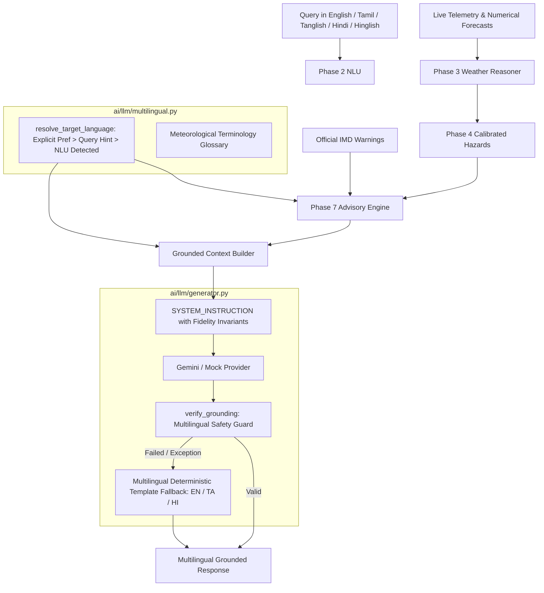

# WeatherGPT — Phase 8: Multilingual Response Generation
**SIH Problem Statement:** SIH26068 (Ministry of Earth Sciences / IMD, Theme: Disaster Management)  
**Developer:** Person 1 (AI / Weather Intelligence Developer)  
**Status:** Complete  
**Date:** 2026-09-08  

---

## 1. Overview & Objectives

Phase 8 establishes **Multilingual Response Generation** (`ai/llm/multilingual.py`, `ai/decision/decision_engine.py`, `ai/llm/generator.py`) for WeatherGPT.

The objective is to provide natural, accurate, and safety-grounded conversational weather answers in **English**, **Tamil** (Tamil script), and **Hindi** (Devanagari script) across all supported personas and emergency alert levels.



### Core Invariant: Translation is Not Reasoning
The multilingual layer **expresses verified meteorological decisions**. It must **never**:
- Recalculate or soften hazard severity.
- Extrapolate or round away critical metrics (e.g. converting $64.5\text{ mm}$ to $60\text{ mm}$).
- Alter temporal scopes (turning a forecast for tomorrow into an observation for now).
- Remove or weaken official IMD warnings.

---

## 2. Supported Languages & Resolution Policy

### Supported Languages
1. **English (`en`)**: Reference administrative language and international terminology.
2. **Tamil (`ta`)**: Natural, contemporary Tamil script for Tamil Nadu and coastal fishing communities.
3. **Hindi (`hi`)**: Clear, conversational Hindi in Devanagari script for nationwide citizens and northern agrarian corridors.

### Input vs Output Language Separation
- **Input Understanding:** Accepts English, pure Tamil script, Tanglish (Romanized Tamil), pure Hindi script, and Hinglish (Romanized Hindi).
- **Output Generation:** Always emits in standard script:
  - Tanglish queries $\to$ Modern **Tamil** script response.
  - Hinglish queries $\to$ Conversational **Hindi** script response.
  - English queries $\to$ Clear **English** response.

### Language Selection Priority (`resolve_target_language`)
1. **Explicit API Parameter:** User-specified profile/request language (`explicit_preference`).
2. **Explicit Query Request:** Inline directive detected in text (e.g., *"respond in Hindi"*, *"tamil-la sollunga"*, *"in English"*).
3. **NLU-Detected Language:** Detected script or transliteration vocabulary.
4. **Safe Default:** English (`en`).

---

## 3. Authoritative Meteorological Glossary (`ai/llm/multilingual.py`)

To avoid confusing transliterations or excessively archaic literalisms, WeatherGPT maintains a curated glossary:

| Meteorological Concept | English | Tamil (தமிழ்) | Hindi (हिन्दी) |
| :--- | :--- | :--- | :--- |
| **Temperature** | Temperature | வெப்பநிலை | तापमान |
| **Precipitation Probability** | Rain Probability | மழை வாய்ப்பு | बारिश की संभावना |
| **Rainfall Amount** | Rainfall Amount | மழை அளவு | बारिश की मात्रा |
| **Wind Speed** | Wind Speed | காற்றின் வேகம் | हवा की गति |
| **Humidity** | Humidity | ஈரப்பதம் | नमी |
| **Heavy Rain** | Heavy Rain | கனமழை | भारी बारिश |
| **Thunderstorm** | Thunderstorm | இடியுடன் கூடிய மழை | गरज के साथ बारिश |
| **Cyclone** | Cyclone | புயல் | चक्रवात |
| **Heatwave** | Heatwave | வெப்ப அலை | लू / भीषण गर्मी |
| **Coldwave** | Coldwave | குளிர் அலை | शीत लहर |
| **Official Alert** | Official IMD Warning | அதிகாரப்பூர்வ IMD எச்சரிக்கை | आधिकारिक IMD चेतावनी |
| **Advisory** | Advisory | ஆலோசனை | सलाह |
| **Key Precautions** | Recommended Precautions | முக்கிய பாதுகாப்பு வழிகாட்டுதல்கள் | मुख्य सावधानियां |
| **Source Attribution** | Source | தகவல் மூலம் | स्रोत |
| **Data Quality Score** | Data Quality Score | தர நம்பகத்தன்மை | डेटा गुणवत्ता स्कोर |

---

## 4. Preservation Safeguards

### Numeric & Metric Unit Preservation
- Temperature values ($31.5^\circ\text{C}$), rain probabilities ($80\%$), wind speeds ($25\text{ km/h}$), and rain quantities ($64.5\text{ mm}$) must not be rounded away or altered across languages.
- Unit symbols ($^\circ\text{C}$, $\text{km/h}$, $\text{mm}$, $\%$) are preserved identically in all language templates.

### Official Warning Prominence
- When an active official alert is present, the alert header (e.g., `⚠️ [அதிகாரப்பூர்வ IMD எச்சரிக்கை]` or `⚠️ [आधिकारिक IMD चेतावनी]`) is placed **prominently at the top** of the response before any local observations.
- Contradictory phrases (e.g., *"no danger"*, *"எச்சரிக்கை இல்லை"*, *"कोई खतरा नहीं"*) are caught and blocked by `verify_grounding`.

### Temporal Window Scoping
- Guidance for `TOMORROW` (*"நாளை"*, *"कल"*) explicitly retains the future forecast scope and does not state that storms or rain are occurring now.
- Immediate observations (*"இன்று"*, *"आज"*, *"now"*) are distinctly separated from diurnal outlooks.

---

## 5. Deterministic Multilingual Fallback (`GroundedLLMGenerator`)

When network timeouts, LLM exceptions, or grounding violations occur, the generator executes deterministic templates:

- **Tamil Fallback Example:**
  ```
  ⚠️ [அதிகாரப்பூர்வ IMD எச்சரிக்கை] Cyclone Warning: Gale winds expected
  Coimbatore-ல் தற்போதைய வெப்பநிலை 32°C, மழை வாய்ப்பு 80%, வானிலை: கனமழை.
  
  ஆலோசனை: அவசியமற்ற பயணங்களைத் தவிர்த்து பாதுகாப்புடன் இருக்கவும்.
  ...
  (தகவல் மூலம்: IMD | புதுப்பிக்கப்பட்டது 5 நிமிடங்களுக்கு முன் | தர நம்பகத்தன்மை: 90/100)
  ```
- **Hindi Fallback Example:**
  ```
  ⚠️ [आधिकारिक IMD चेतावनी] Cyclone Warning: Gale winds expected
  Coimbatore में वर्तमान तापमान 32°C है और बारिश की संभावना 80% है (मौसम: भारी बारिश)।
  
  सलाह: अनावश्यक यात्रा से बचें और स्थानीय प्रशासन के निर्देशों का पालन करें।
  ...
  (स्रोत: IMD | 5 मिनट पहले अपडेट किया गया | डेटा गुणवत्ता स्कोर: 90/100)
  ```

---

## 6. Test Verification & Coverage

24 dedicated automated tests in `tests/test_ai_multilingual_depth.py` validate all multilingual functional and safety criteria:

| Test Name | Validated Capability | Result |
| :--- | :--- | :--- |
| `test_english_response_generation` | Full English grounded response generation | **PASSED** |
| `test_tamil_response_generation` | Pure Tamil response generation with glossary terms | **PASSED** |
| `test_hindi_response_generation` | Pure Hindi response generation with glossary terms | **PASSED** |
| `test_tamil_user_query` | Tamil query $\to$ Tamil response through pipeline | **PASSED** |
| `test_tanglish_user_query` | Tanglish query $\to$ Tamil response | **PASSED** |
| `test_hindi_user_query` | Hindi query $\to$ Hindi response through pipeline | **PASSED** |
| `test_hinglish_user_query` | Hinglish query $\to$ Hindi response | **PASSED** |
| `test_explicit_language_request_in_query` | Query override (e.g. "respond in Hindi") | **PASSED** |
| `test_mixed_language_code_switching` | Stable single-language selection for code-switched inputs | **PASSED** |
| `test_numeric_preservation` | Numerical metrics ($32^\circ\text{C}$, $80\%$) preserved | **PASSED** |
| `test_unit_preservation` | Metric units ($^\circ\text{C}$, $\%$) preserved | **PASSED** |
| `test_temporal_preservation_tomorrow` | Temporal window (`TOMORROW`) preserved in Hindi | **PASSED** |
| `test_official_warning_prominence_all_languages` | Warning header placed first across EN, TA, HI | **PASSED** |
| `test_hazard_severity_preservation` | Priority and risk level invariant across EN, TA, HI | **PASSED** |
| `test_advisory_action_preservation_hindi_tamil` | Farmer/Fisherman precautions in Hindi/Tamil | **PASSED** |
| `test_source_attribution_preservation` | `IMD` and localized source labels preserved | **PASSED** |
| `test_observational_uncertainty_preservation` | Observational disagreement noted in TA and HI | **PASSED** |
| `test_consistency_score_semantics_all_languages` | Data quality score labeled accurately in EN, TA, HI | **PASSED** |
| `test_missing_weather_data_all_languages` | Safe missing data messages in EN, TA, HI | **PASSED** |
| `test_source_conflict_all_languages` | Conflict warnings preserved across languages | **PASSED** |
| `test_fallback_generation_all_languages` | Deterministic template execution for EN, TA, HI | **PASSED** |
| `test_invalid_language_request_handling` | Graceful fallback to default English | **PASSED** |
| `test_empty_llm_response_triggers_target_fallback` | Empty response triggers target-language fallback | **PASSED** |
| `test_full_pipeline_multilingual_integration` | End-to-end pipeline execution in EN, TA, HI | **PASSED** |

**Full Regression Test Suite:** **176 / 176 tests passing** across the repository.

---

## 7. Boundaries & Exclusions

- **Phase 9 Boundary:** Complete response validation, multi-dimensional hallucination scoring, and safety filters will be implemented in Phase 9.
- **Person 2 Boundary:** Text-to-Speech (TTS) audio synthesis and voice endpoint integrations are owned by Person 2. Person 1 produces structured, multilingual natural language text.
