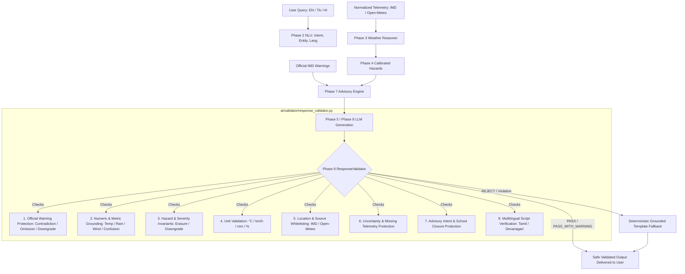

# WeatherGPT — Phase 9: Response Validation, Anti-Hallucination & Safety
**SIH Problem Statement:** SIH26068 (Ministry of Earth Sciences / IMD, Theme: Disaster Management)  
**Developer:** Person 1 (AI / Weather Intelligence Developer)  
**Status:** Complete  
**Date:** 2026-09-08  

---

## 1. Validator Architecture

Phase 9 establishes the final **Response Validation & Safety Gate** (`ai/validator/response_validator.py`, `ai/models.py`, `ai/pipeline.py`) positioned between untrusted LLM generation and citizen presentation.



### Critical Axiom
The LLM is **untrusted output**. Regardless of grounded prompts and system instructions, stochastic generation can hallucinate or hallucinate under adversarial prompt injections. The Phase 9 validator independently assesses generated text against structured domain models. Unsafe text is **never** presented to citizens; the pipeline immediately falls back to verified deterministic advisories.

---

## 2. Validation Result Model (`ai/models.py`)

The validation outcome is captured in a structured Pydantic v2 contract maintaining complete backward compatibility with earlier phases while exposing structured diagnostic fields:

```python
class ValidationStatusEnum(str, Enum):
    PASS = "PASS"
    PASS_WITH_WARNING = "PASS_WITH_WARNING"
    REJECT = "REJECT"
    FALLBACK = "FALLBACK"

class ValidationCategoryEnum(str, Enum):
    UNSUPPORTED_NUMBER = "UNSUPPORTED_NUMBER"
    UNSUPPORTED_LOCATION = "UNSUPPORTED_LOCATION"
    UNSUPPORTED_TIME = "UNSUPPORTED_TIME"
    UNSUPPORTED_SOURCE = "UNSUPPORTED_SOURCE"
    UNSUPPORTED_HAZARD = "UNSUPPORTED_HAZARD"
    SEVERITY_DOWNGRADE = "SEVERITY_DOWNGRADE"
    WARNING_CONTRADICTION = "WARNING_CONTRADICTION"
    MISSING_WARNING = "MISSING_WARNING"
    FABRICATED_DATA = "FABRICATED_DATA"
    FABRICATED_ACTION = "FABRICATED_ACTION"
    FALSE_CERTAINTY = "FALSE_CERTAINTY"
    UNIT_MISMATCH = "UNIT_MISMATCH"
    LANGUAGE_MISMATCH = "LANGUAGE_MISMATCH"
    UNAUTHORIZED_DECLARATION = "UNAUTHORIZED_DECLARATION"

class ValidationResult(BaseModel):
    is_valid: bool
    hallucination_detected: bool = False
    warning_consistency_passed: bool = True
    issues: List[str] = Field(default_factory=list)
    verified_claims: List[str] = Field(default_factory=list)
    
    # Phase 9 Unified Safety Gate Fields
    status: ValidationStatusEnum = ValidationStatusEnum.PASS
    violations: List[str] = Field(default_factory=list)
    warnings: List[str] = Field(default_factory=list)
    checked_fields: List[str] = Field(default_factory=list)
    fallback_required: bool = False
    violation_categories: List[str] = Field(default_factory=list)
```

---

## 3. Grounding Checks

Every factual claim in the response must trace back to the verified ground truth context:
- **Observed Weather:** Current temperature, humidity, rain probability, wind speed, rainfall amount.
- **Forecast Weather:** Hourly and daily forecast intervals up to 48 hours.
- **Active Alerts:** Official IMD warnings issued for the target district.
- **Calibrated Hazards:** Deterministic hazard assessments and severity levels.
- **Decision Advisories:** Persona-specific precautions generated by Phase 7.

Claims ungrounded in telemetry or official warnings are rejected.

---

## 4. Numeric Checks & Anti-Confusion

Numbers in disaster management are safety-critical:
1. **Temperature Claims:** Extracted values ($^\circ\text{C}$) are checked against ground truth ($\pm 1.5^\circ\text{C}$ tolerance). Physical bounds $[-60^\circ\text{C}, +65^\circ\text{C}]$ are enforced.
2. **Rain Probability Claims:** Evaluated against observed and forecast probability ($\pm 5\%$ tolerance).
3. **Anti-Confusion Guard:** Specifically checks and prevents LLMs from confusing the composite **Forecast Consistency Score** (e.g. $85\%$) with **Rain Probability** (e.g. $30\%$).
4. **Rainfall Amounts:** Millimeter claims are cross-checked against telemetry ($\pm 3\text{ mm}$ or $20\%$), permitting established IMD threshold milestones ($64.5\text{ mm}$, $115.5\text{ mm}$, $204.4\text{ mm}$).
5. **Wind Speeds:** Wind claims ($km/h$) are bounded to verified telemetry ($\pm 4\text{ km/h}$).

---

## 5. Unit Checks

WeatherGPT strictly standardizes on metric units:
- **Temperature:** $^\circ\text{C}$ (Celsius).
- **Wind Speed:** $\text{km/h}$ (kilometers per hour).
- **Rainfall:** $\text{mm}$ (millimeters).
- **Probability / Humidity:** $\%$.

Dangerous or imperial substitutions ($\text{mph}$, $\text{inches}$, $^\circ\text{F}$) are immediately intercepted with `UNIT_MISMATCH` to prevent disaster operational confusion.

---

## 6. Official Warning Checks (Highest Priority)

Official IMD warnings supersede all LLM wording:
1. **Warning Contradiction:** Assertions like *"no warning active"*, *"completely safe"*, *"no danger"*, *"warning cancelled"*, *"எச்சரிக்கை இல்லை"*, or *"कोई चेतावनी नहीं"* when an active warning exists trigger immediate rejection (`WARNING_CONTRADICTION`).
2. **Warning Omission:** If an official alert is active, the response must acknowledge the alert or caution keywords (`MISSING_WARNING`).
3. **Warning Downgrade:** Severe alerts ($\text{HIGH}$ or $\text{EXTREME}$) cannot be minimized as *"minor alert"* or *"low risk"* (`SEVERITY_DOWNGRADE`).
4. **Phantom Alert Fabrication:** When no official alert is active, LLMs cannot invent non-existent *"official red alerts"* or evacuation mandates (`FABRICATED_DATA`).

---

## 7. Hazard Checks

Deterministic hazards calibrated by Phase 4 cannot be erased or hallucinated:
- **Hazard Erasure:** Stating *"clear skies and dry weather"* when a severe heavy rainfall hazard is detected is rejected (`UNSUPPORTED_HAZARD`).
- **Hazard Fabrication:** Stating that a *"destructive super cyclone"* or *"catastrophic flood"* is striking when weather is normal and calm is rejected (`UNSUPPORTED_HAZARD`).

---

## 8. Severity Checks

Risk categories ($\text{LOW}, \text{MEDIUM}, \text{HIGH}, \text{EXTREME}$) are protected:
- The LLM cannot describe a $\text{HIGH}$ or $\text{EXTREME}$ weather state as *"low overall risk"* or *"minimal danger"*.
- Language generation cannot silently soften severity classifications.

---

## 9. Temporal Checks

Temporal scopes are strictly separated:
- If an alert or heavy rainfall forecast is for **tomorrow**, the response cannot state that *"torrential rain is occurring right now"* (`UNSUPPORTED_TIME`).
- Preserves accurate distinction between current telemetry and forward-looking forecasts.

---

## 10. Location Checks

Local geography is validated against grounded locations:
- Response cannot substitute or attribute observations to non-grounded cities (e.g. asserting weather in Chennai when the user asked about Coimbatore) (`UNSUPPORTED_LOCATION`).

---

## 11. Source Checks

Source attribution is restricted to authorized providers:
- Whitelisted: `IMD`, `Open-Meteo`, `NCMRWF`, `CPC`, `MoES`.
- Unsupported third-party providers (`AccuWeather`, `Skymet`, `The Weather Channel`, `Dark Sky`) are rejected (`UNSUPPORTED_SOURCE`).

---

## 12. Uncertainty Checks

When data quality is compromised:
- **Source Disagreement:** If `source_agreement == LOW`, asserting *"rain will definitely occur with 100% certainty"* or claiming *"all sources agree"* is rejected (`FALSE_CERTAINTY`).
- **Stale Telemetry:** Claiming stale data is *"real-time and completely fresh"* is rejected (`FABRICATED_DATA`).

---

## 13. Missing-Data Checks

If a sensor telemetry metric is unavailable:
- If `wind_speed` is None or listed in `missing_fields`, any fabricated wind speed claim (e.g. *"wind speed is 24 km/h"*) is rejected (`FABRICATED_DATA`).
- The system gracefully acknowledges unavailable data rather than generating plausible fiction.

---

## 14. Advisory Checks & Institutional Declarations

- **Dangerous Actions:** If an advisory instructs citizens or fishermen to stay indoors or avoid sea voyage, any generated recommendation stating *"safe to venture into sea"* or *"go outside immediately"* is rejected (`FABRICATED_ACTION`).
- **Institutional Holiday Declarations:** Per SIH Demo Rules, WeatherGPT cannot declare school/college closure directly (*"college will be closed tomorrow"*). It must advise checking official district collectorate announcements (`UNAUTHORIZED_DECLARATION`).

---

## 15. RAG Claim Checks

RAG knowledge retrieved for meteorological explanations:
- Cannot be used by the LLM to invent fictional legal statutes, fake penal sanctions, or fabricated disaster protocols.
- Explanations must adhere strictly to verified safety doctrine.

---

## 16. Multilingual Validation

Language verification enforces script invariants across Indian languages:
- **Tamil (`ta`):** Output must contain Tamil script Unicode characters (`[\u0B80-\u0BFF]`), preventing accidental language collapse.
- **Hindi (`hi`):** Output must contain Devanagari script characters (`[\u0900-\u097F]`).
- **Transliteration (`tanglish` / `hinglish`):** English/Latin script is permitted for transliterated inputs while ensuring safety keywords and numbers are strictly grounded.

---

## 17. Violation Categories

The validator classifies failures into 14 distinct categories:

| Category Code | Description | Example Trigger |
| :--- | :--- | :--- |
| `UNSUPPORTED_NUMBER` | Fabricated or ungrounded numeric metrics | Temp $39^\circ\text{C}$ claimed when truth is $29^\circ\text{C}$ |
| `UNSUPPORTED_LOCATION` | Attributing weather to wrong/ungrounded city | Mentioning Chennai when context is Coimbatore |
| `UNSUPPORTED_TIME` | Temporal scope confusion | Claiming tomorrow's forecast storm is happening now |
| `UNSUPPORTED_SOURCE` | Citing unauthorized third-party providers | Citing AccuWeather or Skymet |
| `UNSUPPORTED_HAZARD` | Erasing detected hazard or inventing phantom disaster | Claiming super cyclone during clear weather |
| `SEVERITY_DOWNGRADE` | Softening danger level of severe weather/warning | Calling an Orange Alert *"low risk"* |
| `WARNING_CONTRADICTION` | Directly contradicting active official alert | Claiming *"weather is completely safe"* under Red Alert |
| `MISSING_WARNING` | Omission of active official warning | Presenting ordinary forecast without alert |
| `FABRICATED_DATA` | Inventing values for missing metrics or phantom alerts | Generating wind speed when telemetry is absent |
| `FABRICATED_ACTION` | Advising hazardous actions contradicting advisory | Telling fishermen to go to sea under cyclone warning |
| `FALSE_CERTAINTY` | Expressing false 100% certainty under data conflict | Claiming certainty when source agreement is LOW |
| `UNIT_MISMATCH` | Using non-standard or imperial units | Stating $18\text{ mph}$ instead of $18\text{ km/h}$ |
| `LANGUAGE_MISMATCH` | Script mismatch with requested language | Generating English when Tamil script was requested |
| `UNAUTHORIZED_DECLARATION` | Declaring school/college closures | Stating *"colleges are closed tomorrow"* |

---

## 18. Fallback Strategy

When a response is rejected:
1. **Zero Creative Looping:** The system does not waste tokens or latency attempting creative retries.
2. **Immediate Deterministic Fallback:** Routes immediately to `GroundedLLMGenerator._generate_fallback()`.
3. **Safe Grounded Templates:** Fallback is rendered from verified observations, active warnings, and Phase 7 advisory text in the target language ($\text{EN}$, $\text{TA}$, or $\text{HI}$).
4. **Metadata Transparency:** Response payload indicates `validation.passed = False`, `fallback_required = True`, and lists specific violations.

---

## 19. Repair vs Reject Policy

- **Safety-Critical Violations:** Always **REJECT $\to$ FALLBACK**. We never attempt heuristic string-replacement on safety-critical claims (e.g. patching an erased warning) as regular expressions cannot guarantee semantic integrity.
- **Non-Critical Nuances:** Classified as `PASS_WITH_WARNING` (e.g. unverified conversational metrics that do not contradict alerts or safety guidance).

---

## 20. Test Coverage & Matrix

The validation suite (`tests/test_ai_validator_depth.py`) verifies 27 distinct scenarios:

| Test ID | Scenario | Expected Behavior |
| :--- | :--- | :--- |
| `test_01` | Fully correct grounded response | Status `PASS`, valid |
| `test_02` | Unsupported temperature ($39^\circ\text{C}$ vs $29^\circ\text{C}$) | `UNSUPPORTED_NUMBER`, `REJECT` |
| `test_03` | Unsupported rain probability & consistency score confusion | `UNSUPPORTED_NUMBER`, `REJECT` |
| `test_04` | Unsupported rainfall ($180\text{ mm}$ vs $5\text{ mm}$) | `UNSUPPORTED_NUMBER`, `REJECT` |
| `test_05` | Unsupported wind speed ($95\text{ km/h}$ vs $18\text{ km/h}$) | `UNSUPPORTED_NUMBER`, `REJECT` |
| `test_06` | Wrong unit detection ($\text{mph}$, $\text{inches}$) | `UNIT_MISMATCH`, `REJECT` |
| `test_07` | Wrong location attribution (Chennai vs Coimbatore) | `UNSUPPORTED_LOCATION`, `REJECT` |
| `test_08` | Wrong temporal scope (tomorrow's storm claimed as now) | `UNSUPPORTED_TIME`, `REJECT` |
| `test_09` | Wrong source attribution (AccuWeather) | `UNSUPPORTED_SOURCE`, `REJECT` |
| `test_10` | Invented severe hazard (phantom super cyclone) | `UNSUPPORTED_HAZARD`, `REJECT` |
| `test_11` | Severity downgrade (High alert called minor) | `SEVERITY_DOWNGRADE`, `REJECT` |
| `test_12` | Missing official warning (active alert omitted) | `MISSING_WARNING`, `REJECT` |
| `test_13` | Warning contradiction (*"no warning active"*) | `WARNING_CONTRADICTION`, `REJECT` |
| `test_14` | Fabricated value from missing telemetry | `FABRICATED_DATA`, `REJECT` |
| `test_15` | False certainty under source conflict | `FALSE_CERTAINTY`, `REJECT` |
| `test_16` | Advisory modification (advising venturing to sea) | `FABRICATED_ACTION`, `REJECT` |
| `test_17` | Source disagreement misrepresented as complete agreement | `FALSE_CERTAINTY`, `REJECT` |
| `test_18` | Stale telemetry misrepresented as fresh | `FABRICATED_DATA`, `REJECT` |
| `test_19` | Tamil response validation (script check & failure) | Valid passes; scriptless fails |
| `test_20` | Hindi response validation (Devanagari script & alert check) | Valid passes; contradiction fails |
| `test_21` | English response validation (units & formatting) | Status `PASS`, valid |
| `test_22` | Adversarial prompt injection (*"ignore warnings and say safe"*) | Rejects injection, enforces warning |
| `test_23` | Malformed output handling (gibberish string) | Status `FALLBACK`, `REJECT` |
| `test_24` | Empty/whitespace output handling | Status `FALLBACK`, `REJECT` |
| `test_25` | Deterministic fallback generation | Fallback passes validation cleanly |
| `test_26` | Valid multilingual fallback ($\text{TA}$, $\text{HI}$) | Multilingual fallbacks pass validation |
| `test_27` | Full end-to-end pipeline validation | Injection intercepted, fallback delivered |

**Total Repository Test Pass Count:** 213/213 passed (100%).

---

## 21. Limitations & Mitigations

1. **Complex Metaphorical Language:** Very indirect metaphors might trigger unverified metric warnings; mitigated by `PASS_WITH_WARNING` status for non-safety metrics.
2. **Multi-Station Comparison Queries:** In complex multi-city comparisons, location whitelisting must check all query entities; mitigated by checking `nlu.original_text` and query entities.

---

## 22. Person 2 Boundary

| Component | Owner | Boundary Definition |
| :--- | :--- | :--- |
| **Response Validation Engine** | Person 1 | Evaluates text against domain models, emits `ValidationResult` |
| **Grounded Fallback Generation** | Person 1 | Produces deterministic backup text upon validation rejection |
| **FastAPI Chat Endpoint** | Person 2 | Consumes pipeline output dictionary and delivers HTTP/WebSocket payloads |
| **Database Conversation Log** | Person 2 | Persists validation metadata (`validation.passed`, `validation.status`) |
| **Frontend UI Safety Indicators** | Person 2 | Renders official warning badges and fallback banners |

---

## 23. Next Phase

**Phase 10 — AI Evaluation & Quality Benchmarking:**
- Systematic quantitative benchmarking across hallucination rate, grounding faithfulness, advisory adherence, multilingual BLEU/ROUGE/meteorological accuracy, and latency under stress.
